<div align="center">

# 🦾 To FK, IK, and Beyond!

**From Joint Angles to Task Space (and the Math in Between)**

[](#-paper-collection)
[](#-benchmarks--evaluation)
[](#-open-source-frameworks)
[](#-references)

</div>

<p align="center">
  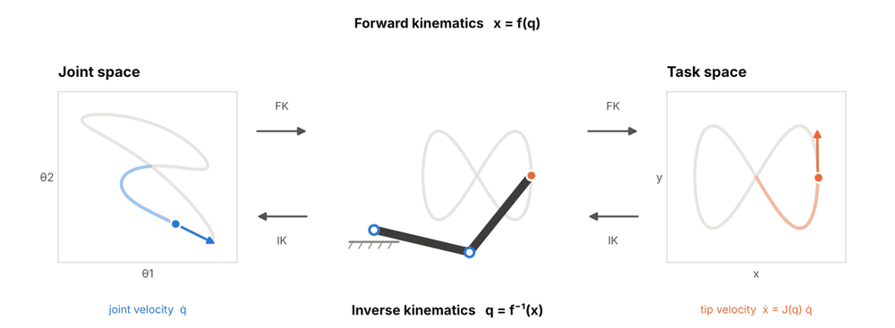
</p>

---

## 📖 Table of Contents

- [Introduction](#-introduction)
- [What is Robot Kinematics?](#-what-is-robot-kinematics)
  - [The Jacobian Matrix](#the-jacobian-matrix)
- [Unified Taxonomy](#-unified-taxonomy)
  - [Mechanisms](#-mechanisms-what-is-moving)
  - [Motion Representations](#-motion-representations-how-is-motion-described)
  - [Problems](#-problems-what-is-being-solved)
- [Worked Examples](#-worked-examples)
  - [Forward Kinematics](#-solved-problem-1-forward-kinematics)
  - [Inverse Kinematics](#-solved-problem-2-inverse-kinematics)
  - [The Jacobian Matrix](#-solved-problem-3-the-jacobian-matrix)
  - [A Spatial Arm with Transformation Matrices](#-solved-problem-4-a-spatial-arm-with-transformation-matrices)
- [Methods by Task & Strength](#-methods-by-task--strength)
  - [By Task](#-by-task-what-do-you-need-from-kinematics)
  - [By Strength](#-by-strength-what-is-each-method-best-at)
  - [Solver Profiles at a Glance](#-solver-profiles-at-a-glance)
- [Paper Collection](#-paper-collection)
  - [Forward Kinematics & Modeling](#-forward-kinematics--modeling)
  - [Rotation & Pose Representations](#-rotation--pose-representations)
  - [Inverse Kinematics](#-inverse-kinematics)
    - [Analytical](#-analytical-inverse-kinematics)
    - [Numerical & Optimization-based](#-numerical--optimization-based-inverse-kinematics)
    - [Learning-based](#-learning-based-inverse-kinematics)
  - [Differential Kinematics, Redundancy & Singularities](#-differential-kinematics-redundancy--singularities)
  - [Learned Kinematic Models & Self-Modeling](#-learned-kinematic-models--self-modeling)
  - [Differentiable & GPU-Accelerated Kinematics](#-differentiable--gpu-accelerated-kinematics)
  - [Parallel & Closed-Chain Mechanisms](#-parallel--closed-chain-mechanisms)
  - [Mobile Robot Kinematics](#-mobile-robot-kinematics)
  - [Legged & Humanoid Whole-Body Kinematics](#-legged--humanoid-whole-body-kinematics)
  - [Motion Retargeting](#-motion-retargeting)
  - [Continuum & Soft Robot Kinematics](#-continuum--soft-robot-kinematics)
  - [Kinematic Calibration & Hand-Eye](#-kinematic-calibration--hand-eye)
  - [Workspace, Reachability & Dexterity](#-workspace-reachability--dexterity)
- [Benchmarks & Evaluation](#-benchmarks--evaluation)
- [Open-Source Frameworks](#-open-source-frameworks)
- [Applications](#-applications)
- [Future Directions](#-future-directions)
- [References](#-references)
- [Citation](#-citation)
- [Contributing](#-contributing)

---

## 🎯 Introduction

A robot that cannot answer **"Where is my hand, given my joints?"** and **"How must my joints move to put it over there?"** cannot do much else. **Robot kinematics** is the study of that relationship: the geometry of motion, described without reference to the forces that cause it.

Kinematics is the layer every other part of the stack stands on. Motion planners search in the joint space it defines, controllers track the velocities it maps, calibration corrects the parameters it assumes, and learned policies output actions that it turns into motor commands. Whether the machine is a six-axis arm on a factory floor, a humanoid copying a human demonstration, a surgical continuum robot, or a car parking itself, the first question is kinematic.

> 🧭 **Sister repository:** once a robot knows how it moves, it needs to know where it is. [IThinkThereforeIMap](https://github.com/SuperMadee/IThinkThereforeIMap) covers SLAM, and [MemoryIsAwesome](https://github.com/SuperMadee/MemoryIsAwesome) covers memory for foundation model agents.

### 📊 Repository Highlights

This repository collects robot kinematics research, featuring:

- **130+ papers** spanning from foundational works (Denavit-Hartenberg, 1955; Pieper, 1968; Whitney, 1969) to GPU-batched and generative inverse kinematics (2025)
- **Unified taxonomy** organizing research by Mechanisms × Representations × Problems
- **Task and strength guide** that maps jobs (closed-form IK, redundancy resolution, whole-body control, calibration, …) to the methods best suited to them
- **10+ robot model collections, motion datasets, standards, and evaluation tools** (MuJoCo Menagerie, robot_descriptions, AMASS, ISO 9283, etc.)
- **30+ open-source frameworks and libraries** (Pinocchio, Drake, KDL, MoveIt 2, TRAC-IK, cuRobo, etc.)
- **25+ references** including surveys, tutorials, textbooks, and courses

### 🔬 Coverage Areas

| Category | Description | Key Topics |
|----------|-------------|------------|
| **📐 Modeling** | Describing a mechanism's geometry | Denavit-Hartenberg parameters, product of exponentials, screw theory, URDF |
| **🔄 Representations** | Describing rotation and pose | Rotation matrices, quaternions, dual quaternions, Lie groups SO(3) and SE(3) |
| **🧮 Analytical IK** | Closed-form joint solutions | Pieper's criterion, subproblem decomposition, IKFast, general 6R |
| **🔁 Numerical IK** | Iterative and optimization-based solvers | Damped least squares, Levenberg-Marquardt, TRAC-IK, RelaxedIK, QP-based IK |
| **📈 Differential Kinematics** | Velocity-level mapping and control | Jacobians, manipulability, null-space projection, task priority, singularities |
| **🧠 Learning-based** | Learned IK and learned kinematic models | IKFlow, generative IK, self-modeling, Neural Jacobian Fields |
| **🕸 Beyond Serial Arms** | Other mechanism families | Parallel robots, wheeled robots, legged robots and humanoids, continuum robots |
| **🎯 Calibration** | Making the model match the hardware | Geometric parameter identification, hand-eye calibration, observability indices |

This repository synthesizes insights from surveys, textbooks, and tutorials on kinematics (see [References](#-references)).

---

## 🧩 What is Robot Kinematics?

### Conceptual Distinction

Kinematics is distinct from related concepts:

| Concept | Description | Key Difference |
|---------|-------------|----------------|
| **Statics** | Forces and torques on a mechanism at rest | No motion; linked to kinematics through the Jacobian transpose |
| **Dynamics** | How forces and torques produce motion | Adds mass, inertia, and time; kinematics is the geometric part it builds on |
| **Motion Planning** | Finding a collision-free path between configurations | Searches the space that kinematics defines; calls FK and IK as subroutines |
| **Control** | Making the real robot follow a desired motion | Closes a feedback loop; kinematics provides the model inside it |
| **State Estimation** | Inferring configuration or pose from sensors | Uses kinematic models as measurement or motion models |
| **Kinematics** | The geometry of motion: position, velocity, and acceleration relationships | No forces, no masses; purely how joint motion maps to body motion |

### The Kinematics Problem in Three Equations

For a robot with joint configuration $q \in \mathbb{R}^n$, **forward kinematics** gives the end-effector pose as a product of joint motions. In the product-of-exponentials form, with joint screw axes $\mathcal{S}_i$ and home pose $M$:

$$
T(q) = e^{[\mathcal{S}_1] q_1} \, e^{[\mathcal{S}_2] q_2} \cdots e^{[\mathcal{S}_n] q_n} \, M \;\in SE(3)
$$

**Differential kinematics** linearizes this map. The Jacobian $J(q)$ relates joint velocities to the end-effector twist $\mathcal{V}$:

$$
\mathcal{V} = J(q)\, \dot{q}
$$

**Inverse kinematics** runs the map backward, usually as a constrained optimization toward a target pose $T_d$:

$$
q^{\star} = \arg\min_{q} \; \lVert \log\!\left( T(q)^{-1} T_d \right) \rVert^{2} \quad \text{s.t.} \quad q_{\min} \le q \le q_{\max}
$$

Almost every method in this repository is a choice of *which mechanism defines* $T(q)$, *how pose and its error are represented*, and *how the inverse or differential problem is solved*.

### The Jacobian Matrix

The **Jacobian** is the matrix of partial derivatives of the forward kinematics map $x = f(q)$. It has one row per task coordinate and one column per joint:

```math
J(q) = \frac{\partial f}{\partial q} =
\begin{bmatrix}
\dfrac{\partial f_1}{\partial q_1} & \cdots & \dfrac{\partial f_1}{\partial q_n} \\
\vdots & \ddots & \vdots \\
\dfrac{\partial f_m}{\partial q_1} & \cdots & \dfrac{\partial f_m}{\partial q_n}
\end{bmatrix}
\in \mathbb{R}^{m \times n}
```

Column $i$ is the end-effector velocity produced when joint $i$ moves at unit speed and every other joint is held still. For a spatial arm the columns of the geometric Jacobian can be written down directly from the joint axes $z_i$, the joint positions $p_i$, and the end-effector position $p_e$:

```math
J_i =
\begin{bmatrix} z_i \times (p_e - p_i) \\ z_i \end{bmatrix} \ \text{(revolute)}
\qquad
J_i =
\begin{bmatrix} z_i \\ 0 \end{bmatrix} \ \text{(prismatic)}
```

**Worked example: planar 2R arm.** With link lengths $l_1, l_2$ and the shorthand $s_1 = \sin\theta_1$, $c_{12} = \cos(\theta_1 + \theta_2)$, the forward kinematics is $x = l_1 c_1 + l_2 c_{12}$, $y = l_1 s_1 + l_2 s_{12}$. Differentiating gives

```math
J(\theta) =
\begin{bmatrix}
-l_1 s_1 - l_2 s_{12} & -l_2 s_{12} \\
l_1 c_1 + l_2 c_{12} & l_2 c_{12}
\end{bmatrix},
\qquad
\det J = l_1 l_2 \sin\theta_2
```

so the arm is singular exactly when $\theta_2 = 0$ or $\theta_2 = \pi$, that is, when it is fully stretched out or folded back on itself.

<p align="center">
  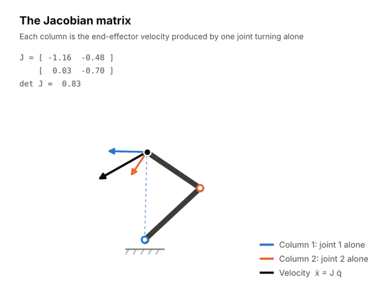
</p>

| Use | Relation | What It Gives |
|-----|----------|---------------|
| **Velocity mapping** | $\dot{x} = J(q)\,\dot{q}$ | End-effector velocity from joint velocities |
| **Statics** | $\tau = J(q)^{\top} F$ | Joint torques that balance an end-effector force |
| **Singularity detection** | $\mathrm{rank} J < m$ | Configurations where some task direction cannot be produced |
| **Numerical inverse kinematics** | $\Delta q = J^{+} e$ | A joint step that reduces the pose error $e$ |
| **Manipulability** | $w = \sqrt{\det(J J^{\top})}$ | A scalar measure of distance from singularity |
| **Redundancy resolution** | $\dot{q} = J^{+}\dot{x} + (I - J^{+}J)\,\dot{q}_0$ | Secondary motion that does not disturb the task |

The **geometric Jacobian** maps joint velocities to linear and angular velocity; the **analytical Jacobian** maps them to the time derivative of a chosen pose parameterization such as Euler angles. The two agree on the translational part and differ on the rotational part. Papers on the Jacobian and its uses are collected under [Differential Kinematics, Redundancy & Singularities](#-differential-kinematics-redundancy--singularities).

### Four Ages of Robot Kinematics

| Era | Period | Focus |
|-----|--------|-------|
| **Mechanism-Theory Age** | 1875–1968 | Linkages and lower pairs, screw theory, Denavit-Hartenberg notation, the Gough-Stewart platform |
| **Manipulator Age** | 1968–1990 | Closed-form IK for industrial arms, resolved-rate control, Jacobians, manipulability, redundancy resolution |
| **Geometric & Algorithmic Age** | 1990–2015 | Lie-group formulations, the general 6R solution, parallel-robot singularities, task-priority and QP-based whole-body IK |
| **Differentiable & Learned Age** | 2015–present | Automatic differentiation, GPU-batched solvers, generative IK, learned kinematic models, large-scale motion retargeting |

This periodization is a reading aid assembled for this repository, not a standard from the literature; the boundaries overlap.

---

## 🧱 Unified Taxonomy

This repository organizes kinematics research through three unified lenses: **Mechanisms**, **Representations**, and **Problems**.

---

### ⚙ Mechanisms (What Is Moving?)

The mechanism determines WHAT the kinematic map looks like.

| Mechanism | Structure | Strengths | Kinematic Difficulty |
|-----------|-----------|-----------|----------------------|
| **🦾 Serial Chain** | Links connected end to end (industrial arms, cobots) | Large workspace, simple forward kinematics | Inverse kinematics has multiple or infinitely many solutions |
| **🕸 Parallel / Closed Chain** | Several legs share one platform (Stewart platform, Delta) | Stiff, fast, precise, high payload-to-weight | Forward kinematics is hard; small workspace; many singularity types |
| **🚗 Wheeled / Mobile Base** | Wheels rolling on a surface | Unbounded workspace, efficient | Nonholonomic constraints: not every velocity is possible |
| **🦿 Floating Base** | Tree of limbs on an unactuated base (legged robots, humanoids) | Mobility over rough terrain, whole-body reach | Base is only controlled through contacts; many tasks compete |
| **🐍 Continuum / Soft** | Continuously bending backbone (tendon robots, concentric tubes) | Compliance, access through narrow paths | Infinite-dimensional shape; kinematics couples with mechanics |

#### 🦾 Serial Chains

> 💡 **Why study it?** The serial arm is the reference mechanism of robotics. Its forward kinematics is a simple product of transforms, and almost every concept in the field (Jacobians, singularities, redundancy) was first worked out on it.

| Class | Degrees of Freedom | Inverse Kinematics |
|-------|--------------------|--------------------|
| **Non-redundant** | Equal to the task dimension (6 for full pose) | Finite number of solutions; up to 16 for a general 6R arm, 8 for most industrial arms |
| **Redundant** | More than the task needs (7-DOF arms) | Infinitely many solutions forming a self-motion manifold |
| **Hyper-redundant** | Far more than the task needs (snake arms) | Usually solved through a backbone curve rather than joint by joint |

#### 🕸 Parallel and Closed Chains

> 💡 **Why study it?** Closing kinematic loops trades workspace for stiffness and speed. That is why flight simulators, pick-and-place Delta robots, and precision positioners are parallel mechanisms, and why their kinematics is the mirror image of the serial case: inverse is easy, forward is hard.

#### 🚗 Wheeled and Mobile Bases

> 💡 **Why study it?** A rolling wheel cannot slide sideways. That single constraint makes mobile robot kinematics a problem about which velocities are allowed rather than which positions are reachable, and it shapes every path a car-like robot can follow.

| Model | Constraint | Typical Platform |
|-------|------------|------------------|
| **Differential drive / unicycle** | Nonholonomic; can turn in place | Indoor service and research robots |
| **Bicycle / Ackermann** | Nonholonomic; minimum turning radius | Cars, autonomous vehicles |
| **Omnidirectional (mecanum, omni-wheel)** | Holonomic in the plane | Warehouse and mobile manipulation bases |

#### 🦿 Floating-Base Systems

> 💡 **Why study it?** Legged robots and humanoids have no joint that fixes them to the world. Their kinematics must account for six unactuated base coordinates and for contact constraints, which turns inverse kinematics into a prioritized multi-task problem.

#### 🐍 Continuum and Soft Robots

> 💡 **Why study it?** A robot without discrete joints has no joint angles to speak of. Continuum kinematics replaces the joint vector with a shape description (arcs, curves, rods), which is the basis of surgical catheters, concentric-tube robots, and soft arms.

---

### 🧊 Motion Representations (How Is Motion Described?)

Representations determine HOW a configuration, pose, or motion is written down.

| Representation | Describes | Strengths | Weaknesses |
|----------------|-----------|-----------|------------|
| **📐 Denavit-Hartenberg Parameters** | Link geometry, four numbers per joint | Compact, standard in industry and datasheets | Several conflicting conventions; ill-conditioned for near-parallel axes |
| **🌀 Screws / Product of Exponentials** | Link geometry as joint screw axes | No link frames needed, no parameter singularities, clean Jacobians | Less familiar; six numbers per joint |
| **🧭 Euler Angles** | Orientation, three numbers | Minimal, human-readable | Gimbal lock; twelve conventions |
| **🔢 Rotation Matrices** | Orientation, nine numbers | Unique, compose by multiplication | Redundant; must stay orthonormal |
| **🎯 Unit Quaternions** | Orientation, four numbers | Singularity-free, cheap to interpolate | Double cover: $q$ and $-q$ are the same rotation |
| **🔗 Dual Quaternions** | Full pose, eight numbers | Unified rotation and translation, good for blending | Two constraints to maintain; less tooling |
| **🧮 Lie Groups SO(3) / SE(3)** | Orientation and pose as manifolds with tangent spaces | Principled errors, derivatives, and uncertainty | Requires manifold-aware optimization |

#### 📐 Link-Frame Conventions

> 💡 **Why use it?** Denavit-Hartenberg parameters turn a drawing of a robot into a table of numbers. They are what manufacturers publish and what calibration procedures identify, so every practitioner has to read them.

| Convention | Idea | Note |
|------------|------|------|
| **Standard (distal) DH** | Frame attached at the far end of each link | The original 1955 formulation |
| **Modified (proximal) DH** | Frame attached at the near end of each link | Popularized by Craig's textbook; easier for tree structures |
| **Hayati modification** | Adds a rotation parameter for near-parallel axes | Removes the discontinuity that breaks calibration |
| **URDF / SDF / MJCF** | Arbitrary fixed transform plus a joint axis per link | The de facto software formats; not minimal but unambiguous |

#### 🌀 Screw Theory and the Product of Exponentials

> 💡 **Why use it?** Every rigid motion is a rotation about and translation along some axis. Describing each joint by that axis in a single fixed frame removes link-frame bookkeeping and makes the Jacobian fall out directly.

#### 🧮 Rotations, Poses, and Lie Groups

> 💡 **Why use it?** Rotations do not form a vector space, so errors, averages, and derivatives need care. Treating orientation and pose as Lie groups gives a consistent way to define them, which matters for IK convergence, calibration, and learning.

---

### 🔄 Problems (What Is Being Solved?)

The classic problems share one model and differ in what is known and what is asked.

| Problem | Given | Find | Typical Methods |
|---------|-------|------|-----------------|
| **Forward Kinematics (FK)** | Joint configuration | End-effector (or any link) pose | Chained homogeneous transforms, product of exponentials |
| **Inverse Kinematics (IK)** | Desired end-effector pose | Joint configuration(s) | Closed-form solutions, Jacobian iteration, nonlinear optimization, learned samplers |
| **Differential Kinematics** | Joint velocities (or desired twist) | End-effector twist (or joint velocities) | Jacobian, pseudoinverse, damped least squares, quadratic programming |
| **Redundancy Resolution** | A task with spare degrees of freedom | The best of the infinitely many solutions | Null-space projection, task priority, hierarchical QP |
| **Singularity Analysis** | The mechanism | Configurations where mobility is lost or gained | Jacobian rank, manipulability, geometric classification |
| **Calibration** | Measured poses and joint readings | The true geometric parameters | Least-squares identification, hand-eye solvers |
| **Workspace Analysis** | The mechanism and its limits | Reachable and dexterous regions | Sampling, capability maps, interval analysis |

| IK Family | Idea | Trade-off |
|-----------|------|-----------|
| **Analytical (closed-form)** | Solve the equations symbolically or geometrically | Microsecond speed and all solutions; only for specific robot structures |
| **Jacobian-based numerical** | Iterate along the linearized map | General and simple; local, sensitive to singularities and joint limits |
| **Optimization-based** | Minimize a cost with constraints | Handles limits, collisions, and multiple goals; slower, depends on the seed |
| **Sampling / evolutionary** | Search the configuration space globally | Escapes local minima; non-deterministic and slower |
| **Learned** | Train a model to propose solutions | Fast batched and diverse proposals; approximate, needs refinement and retraining per robot |

---

## 🧪 Worked Examples

Four solved problems, each starting from a Denavit-Hartenberg table and worked with homogeneous transformation matrices: one for each of the core questions on a planar arm, then a spatial arm solved end to end. Each has the full written solution and an animation that walks through the same steps.

---

### 📐 Solved Problem 1: Forward Kinematics

> **Problem.** A planar 3R arm is described by the Denavit-Hartenberg table below, with lengths in meters. Find the position and orientation of the end-effector.

| Joint $i$ | $\theta_i$ | $d_i$ | $a_i$ | $\alpha_i$ |
|-----------|-----------|-------|-------|-----------|
| 1 | $30^\circ$ | 0 | 1.0 | 0 |
| 2 | $45^\circ$ | 0 | 0.8 | 0 |
| 3 | $-30^\circ$ | 0 | 0.5 | 0 |

<p align="center">
  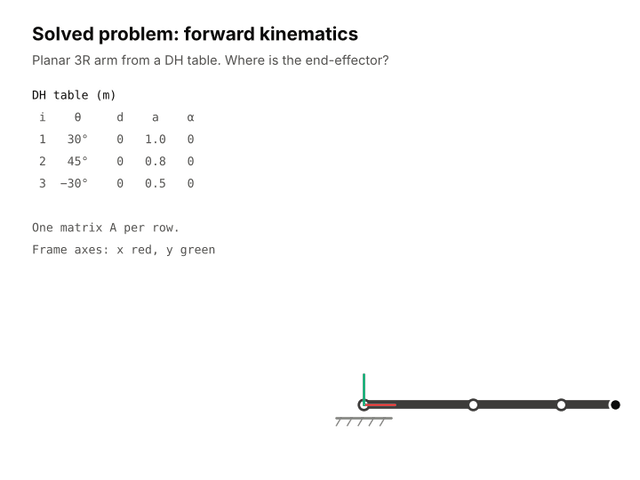
</p>

**Solution.**

1. **Write one transform per row of the table.** In the standard Denavit-Hartenberg convention, the transform from frame $i-1$ to frame $i$ is

```math
A_i =
\begin{bmatrix}
\cos\theta_i & -\sin\theta_i\cos\alpha_i & \sin\theta_i\sin\alpha_i & a_i\cos\theta_i \\
\sin\theta_i & \cos\theta_i\cos\alpha_i & -\cos\theta_i\sin\alpha_i & a_i\sin\theta_i \\
0 & \sin\alpha_i & \cos\alpha_i & d_i \\
0 & 0 & 0 & 1
\end{bmatrix}
```

   Every row here has $\alpha_i = 0$ and $d_i = 0$, so each $A_i$ is a rotation about $z$ by $\theta_i$ followed by a shift of $a_i$ along the new $x$ axis:

```math
A_1 =
\begin{bmatrix}
0.866 & -0.500 & 0 & 0.866 \\
0.500 & 0.866 & 0 & 0.500 \\
0 & 0 & 1 & 0 \\
0 & 0 & 0 & 1
\end{bmatrix}
\quad
A_2 =
\begin{bmatrix}
0.707 & -0.707 & 0 & 0.566 \\
0.707 & 0.707 & 0 & 0.566 \\
0 & 0 & 1 & 0 \\
0 & 0 & 0 & 1
\end{bmatrix}
\quad
A_3 =
\begin{bmatrix}
0.866 & 0.500 & 0 & 0.433 \\
-0.500 & 0.866 & 0 & -0.250 \\
0 & 0 & 1 & 0 \\
0 & 0 & 0 & 1
\end{bmatrix}
```

2. **Chain the transforms.**

```math
T_2^0 = A_1 A_2 =
\begin{bmatrix}
0.259 & -0.966 & 0 & 1.073 \\
0.966 & 0.259 & 0 & 1.273 \\
0 & 0 & 1 & 0 \\
0 & 0 & 0 & 1
\end{bmatrix}
\qquad
T_3^0 = A_1 A_2 A_3 =
\begin{bmatrix}
0.707 & -0.707 & 0 & 1.427 \\
0.707 & 0.707 & 0 & 1.626 \\
0 & 0 & 1 & 0 \\
0 & 0 & 0 & 1
\end{bmatrix}
```

3. **Read off the pose.** The last column of $T_3^0$ is the position. The rotation block is a rotation about $z$ by $\mathrm{atan2}(0.707,\; 0.707) = 45^\circ$, which equals $\theta_1 + \theta_2 + \theta_3$ as expected for a planar arm.

**Answer.** The end-effector is at $(x, y) = (1.43,\; 1.63)$ m with orientation $\phi = 45^\circ$.

---

### 🔙 Solved Problem 2: Inverse Kinematics

> **Problem.** A planar 2R arm is described by the Denavit-Hartenberg table below, with lengths in meters. Find all joint angles $\theta_1, \theta_2$ that place the end-effector at $(x, y) = (1.2,\; 0.9)$ m.

| Joint $i$ | $\theta_i$ | $d_i$ | $a_i$ | $\alpha_i$ |
|-----------|-----------|-------|-------|-----------|
| 1 | $\theta_1$ | 0 | 1.0 | 0 |
| 2 | $\theta_2$ | 0 | 0.8 | 0 |

<p align="center">
  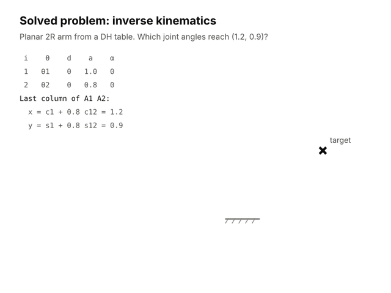
</p>

**Solution.**

1. **Build the forward map from the table.** With the joint angles left as unknowns, and writing $c_1 = \cos\theta_1$, $s_{12} = \sin(\theta_1 + \theta_2)$, the product of the two link transforms is

```math
T_2^0 = A_1 A_2 =
\begin{bmatrix}
c_{12} & -s_{12} & 0 & a_1 c_1 + a_2 c_{12} \\
s_{12} & c_{12} & 0 & a_1 s_1 + a_2 s_{12} \\
0 & 0 & 1 & 0 \\
0 & 0 & 0 & 1
\end{bmatrix}
```

2. **Set the last column equal to the target.** This gives two equations in two unknowns:

```math
c_1 + 0.8\,c_{12} = 1.2, \qquad s_1 + 0.8\,s_{12} = 0.9
```

3. **Eliminate $\theta_1$.** Squaring and adding the two equations leaves only $\theta_2$:

   $x^2 + y^2 = a_1^2 + a_2^2 + 2 a_1 a_2 \cos\theta_2 \;\Rightarrow\; \cos\theta_2 = \dfrac{2.25 - 1 - 0.64}{1.6} = 0.381 \;\Rightarrow\; \theta_2 = \pm 67.6^\circ$

   Geometrically, the elbow lies where a circle of radius $a_1$ about the base meets a circle of radius $a_2$ about the target, and the two intersections are the two signs.

4. **Solve for $\theta_1$,** one value for each sign of $\theta_2$:

   $\theta_1 = \mathrm{atan2}(y, x) - \mathrm{atan2}(a_2 \sin\theta_2,\; a_1 + a_2\cos\theta_2) = 36.9^\circ \mp 29.5^\circ$

5. **Check.** Substituting either pair back into the last column of $T_2^0$ returns $(1.2,\; 0.9)$.

**Answer.**

| Solution | $\theta_1$ | $\theta_2$ |
|----------|-----------|-----------|
| Elbow down | $7.3^\circ$ | $67.6^\circ$ |
| Elbow up | $66.4^\circ$ | $-67.6^\circ$ |

---

### 📈 Solved Problem 3: The Jacobian Matrix

> **Problem.** The 2R arm of Problem 2 is at the configuration in the table below and its joints turn at $\dot\theta = (0.5,\; -1.0)$ rad/s. Find the Jacobian, the end-effector velocity, and whether the arm is at a singularity.

| Joint $i$ | $\theta_i$ | $d_i$ | $a_i$ | $\alpha_i$ |
|-----------|-----------|-------|-------|-----------|
| 1 | $30^\circ$ | 0 | 1.0 | 0 |
| 2 | $60^\circ$ | 0 | 0.8 | 0 |

<p align="center">
  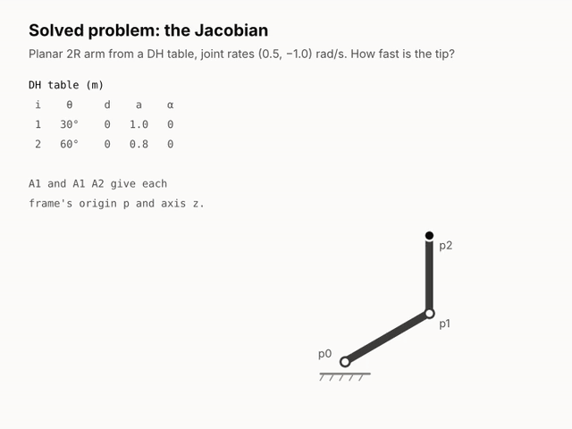
</p>

**Solution.**

1. **Compute the frame transforms from the table.**

```math
T_1^0 = A_1 =
\begin{bmatrix}
0.866 & -0.500 & 0 & 0.866 \\
0.500 & 0.866 & 0 & 0.500 \\
0 & 0 & 1 & 0 \\
0 & 0 & 0 & 1
\end{bmatrix}
\qquad
T_2^0 = A_1 A_2 =
\begin{bmatrix}
0 & -1 & 0 & 0.866 \\
1 & 0 & 0 & 1.300 \\
0 & 0 & 1 & 0 \\
0 & 0 & 0 & 1
\end{bmatrix}
```

2. **Read off the axes and origins.** The third column of each transform is the joint axis and the fourth is the frame origin: $z_0 = z_1 = (0, 0, 1)$, $p_0 = (0, 0, 0)$, $p_1 = (0.866,\; 0.5,\; 0)$, $p_2 = (0.866,\; 1.3,\; 0)$.

3. **Build the columns.** For a revolute joint, column $i$ is $z_{i-1} \times (p_2 - p_{i-1})$:

```math
J_1 = z_0 \times (p_2 - p_0) = \begin{bmatrix} -1.300 \\ 0.866 \\ 0 \end{bmatrix}
\qquad
J_2 = z_1 \times (p_2 - p_1) = \begin{bmatrix} -0.800 \\ 0 \\ 0 \end{bmatrix}
```

   The arm moves in the plane, so keep the $x$ and $y$ rows:

```math
J =
\begin{bmatrix}
-1.300 & -0.800 \\
0.866 & 0
\end{bmatrix}
```

4. **Multiply by the joint rates.**

```math
v = J\,\dot\theta = 0.5 \begin{bmatrix} -1.300 \\ 0.866 \end{bmatrix} - 1.0 \begin{bmatrix} -0.800 \\ 0 \end{bmatrix} = \begin{bmatrix} 0.150 \\ 0.433 \end{bmatrix} \ \text{m/s}
```

5. **Check for singularity.** $\det J = (-1.3)(0) - (-0.8)(0.866) = 0.693 \ne 0$, which matches the closed form $a_1 a_2 \sin\theta_2$ from [The Jacobian Matrix](#the-jacobian-matrix).

**Answer.** The end-effector moves at $v = (0.15,\; 0.43)$ m/s, a speed of $0.46$ m/s, and the arm is not at a singularity.

---

### 🧮 Solved Problem 4: A Spatial Arm with Transformation Matrices

> **Problem.** A spatial 3R arm (waist, shoulder, elbow) is described by the Denavit-Hartenberg table below, with lengths in meters. At $\theta = (30^\circ, 60^\circ, -90^\circ)$ and joint rates $\dot\theta = (0.5,\; -0.4,\; 0.8)$ rad/s, find (a) the pose of the tip frame, (b) the Jacobian for linear velocity, and (c) the tip velocity and whether the arm is at a singularity.

| Joint $i$ | $\theta_i$ | $d_i$ | $a_i$ | $\alpha_i$ |
|-----------|-----------|-------|-------|-----------|
| 1 | $\theta_1$ | 0.4 | 0 | $90^\circ$ |
| 2 | $\theta_2$ | 0 | 0.5 | 0 |
| 3 | $\theta_3$ | 0 | 0.4 | 0 |

<p align="center">
  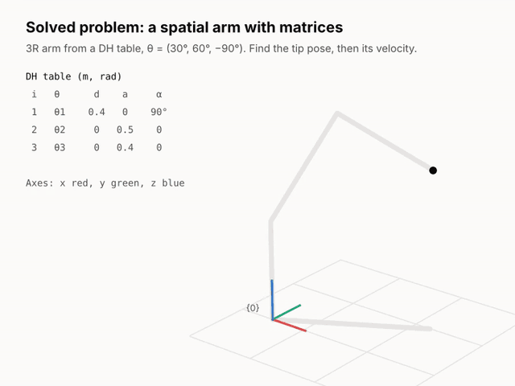
</p>

**Solution.**

1. **Write one transform per row of the table,** using the general matrix $A_i$ from Problem 1. Here the first row has $\alpha_1 = 90^\circ$ and $d_1 = 0.4$, which tips the shoulder axis sideways and lifts it off the floor, so the arm is no longer planar.

   Substituting each row of the table with the given angles:

```math
A_1 =
\begin{bmatrix}
0.866 & 0 & 0.500 & 0 \\
0.500 & 0 & -0.866 & 0 \\
0 & 1 & 0 & 0.4 \\
0 & 0 & 0 & 1
\end{bmatrix}
\quad
A_2 =
\begin{bmatrix}
0.500 & -0.866 & 0 & 0.250 \\
0.866 & 0.500 & 0 & 0.433 \\
0 & 0 & 1 & 0 \\
0 & 0 & 0 & 1
\end{bmatrix}
\quad
A_3 =
\begin{bmatrix}
0 & 1 & 0 & 0 \\
-1 & 0 & 0 & -0.4 \\
0 & 0 & 1 & 0 \\
0 & 0 & 0 & 1
\end{bmatrix}
```

2. **Chain the transforms.** Multiplying left to right gives the pose of each frame in the base frame:

```math
T_2^0 = A_1 A_2 =
\begin{bmatrix}
0.433 & -0.750 & 0.500 & 0.217 \\
0.250 & -0.433 & -0.866 & 0.125 \\
0.866 & 0.500 & 0 & 0.833 \\
0 & 0 & 0 & 1
\end{bmatrix}
\qquad
T_3^0 = A_1 A_2 A_3 =
\begin{bmatrix}
0.750 & 0.433 & 0.500 & 0.517 \\
0.433 & 0.250 & -0.866 & 0.298 \\
-0.500 & 0.866 & 0 & 0.633 \\
0 & 0 & 0 & 1
\end{bmatrix}
```

   The upper-left $3 \times 3$ block of $T_3^0$ is the orientation of the tip frame and the last column is its position, $p_3 = (0.517,\; 0.298,\; 0.633)$ m.

3. **Build the Jacobian from the same matrices.** For a revolute joint, column $i$ is $z_{i-1} \times (p_3 - p_{i-1})$, where $z_{i-1}$ is the third column and $p_{i-1}$ the fourth column of $T_{i-1}^0$. Reading them off: $z_0 = (0, 0, 1)$ and $p_0 = (0, 0, 0)$; $z_1 = z_2 = (0.500,\; -0.866,\; 0)$; $p_1 = (0,\; 0,\; 0.4)$; $p_2 = (0.217,\; 0.125,\; 0.833)$. The three cross products give

```math
J =
\begin{bmatrix}
-0.298 & -0.202 & 0.173 \\
0.517 & -0.117 & 0.100 \\
0 & 0.596 & 0.346
\end{bmatrix}
```

4. **Multiply by the joint rates.**

```math
v = J\,\dot\theta =
\begin{bmatrix}
-0.298 & -0.202 & 0.173 \\
0.517 & -0.117 & 0.100 \\
0 & 0.596 & 0.346
\end{bmatrix}
\begin{bmatrix} 0.5 \\ -0.4 \\ 0.8 \end{bmatrix}
=
\begin{bmatrix} 0.070 \\ 0.385 \\ 0.039 \end{bmatrix} \ \text{m/s}
```

5. **Check for singularity.** For this arm the determinant has the closed form $\det J = -a_2 a_3 \sin\theta_3 \,(a_2\cos\theta_2 + a_3\cos(\theta_2 + \theta_3))$, which evaluates to $0.119$. It vanishes when $\sin\theta_3 = 0$ (elbow stretched or folded) or when $a_2\cos\theta_2 + a_3\cos(\theta_2+\theta_3) = 0$ (tip on the waist axis). Neither holds here.

**Answer.** (a) The tip is at $(0.517,\; 0.298,\; 0.633)$ m with the orientation given by the rotation block of $T_3^0$. (b) $J$ is the matrix in step 3. (c) The tip moves at $v = (0.070,\; 0.385,\; 0.039)$ m/s, a speed of $0.39$ m/s, and $\det J = 0.119 \ne 0$, so the arm is not at a singularity.

---

## 🏆 Methods by Task & Strength

The taxonomy above describes how kinematics methods are *built*. This section classifies them by what they are *for* and what they are *good at*, so you can go from a job to a shortlist. Every method named here has an entry in the [Paper Collection](#-paper-collection) or [Open-Source Frameworks](#-open-source-frameworks).

> ℹ **How to read this.** Strengths reflect what each paper reports and how the method is commonly used in practice. They are not rankings from one unified benchmark, and results shift with the robot, joint limits, seeds, and tolerances. Always validate on your own robot.

---

### 🧭 By Task (What Do You Need From Kinematics?)

| Task | Output You Need | Representative Methods | Why These |
|------|-----------------|------------------------|-----------|
| **🏭 Fast IK for a standard 6-DOF arm** | Every joint solution in microseconds | IKFast, EAIK, IK-Geo, Pieper-style closed forms | Closed-form solvers return all branches deterministically, which planners need |
| **🦾 IK for a 7-DOF redundant arm** | One good solution, or the whole self-motion | Shimizu et al. (S-R-S arms), Franka analytical IK, TRAC-IK, cuRobo | Analytical solvers parameterize redundancy by an arm angle; numerical solvers handle arbitrary limits |
| **🔧 General-purpose IK for any URDF** | A reliable solution with joint limits respected | TRAC-IK, KDL, pick_ik, BioIK, Levenberg-Marquardt (Sugihara) | Need only a robot description; mature MoveIt and ROS integration |
| **🎮 Real-time teleoperation and servoing** | Smooth joint motion tracking a moving target | RelaxedIK, RangedIK, CollisionIK, NEO, damped least squares | Trade exact pose matching for continuity, singularity avoidance, and collision clearance |
| **🧍 Whole-body IK for humanoids and legged robots** | Joint motion satisfying many tasks at once | Hierarchical QP, Stack of Tasks, Pink, mink, PlaCo, TSID | Weighted or strictly prioritized tasks with contact, balance, and limit constraints |
| **🚀 Many IK queries for planning** | Thousands of collision-free solutions in parallel | cuRobo, PyRoki, IKFlow, pytorch_kinematics | Batched on GPU; learned samplers provide diverse seeds |
| **🕺 Motion retargeting** | Robot motion matching a human or animated source | GMR, dex-retargeting (AnyTeleop), DexPilot, Skeleton-Aware Networks | Map between different skeletons while respecting the target's limits |
| **🕸 Parallel robot kinematics** | Platform pose from leg lengths, and singularity maps | Husty's algorithm, Gosselin-Angeles classification, Merlet's interval methods | Forward kinematics has up to 40 solutions; singularities must be mapped in advance |
| **🚗 Mobile base motion** | Feasible paths and velocity commands | Unicycle and bicycle models, Dubins and Reeds-Shepp curves, pure pursuit | Encode nonholonomic constraints directly in the model |
| **🐍 Continuum robot shape** | Backbone shape from actuator inputs | Piecewise constant curvature, Cosserat rod models, modal approaches | Reduce an infinite-dimensional shape to a few parameters |
| **🎯 Making the model match the robot** | Corrected geometric parameters and sensor mounting | POE-based calibration, Hayati parameters, Tsai-Lenz, Park-Martin, DREAM | Identify link parameters and hand-eye transforms from measurements |
| **🌐 Robot placement and design** | Where the robot can reach, and how well | Capability maps, Reuleaux, manipulability and conditioning indices | Precompute reachability and dexterity over the workspace |

---

### 💪 By Strength (What Is Each Method Best At?)

| Strength | Methods That Stand Out | Typical Trade-off |
|----------|------------------------|-------------------|
| **⚡ Raw speed** | IKFast, EAIK, IK-Geo | Only for arms whose structure admits a closed form |
| **📋 Returns all solutions** | IKFast, EAIK, IK-Geo, Raghavan-Roth, Husty-Pfurner | Redundant arms need a free parameter to be discretized |
| **🧩 Works on any robot description** | TRAC-IK, KDL, pick_ik, BioIK, Pink, mink | Local; quality depends on the initial guess |
| **🚧 Respects joint limits** | TRAC-IK, SNS (saturation in the null space), QP-based IK, cuRobo | More computation per iteration than a plain pseudoinverse |
| **🌀 Robust near singularities** | Damped least squares, selectively damped least squares, Levenberg-Marquardt, RelaxedIK | Accepts a small tracking error in exchange for bounded joint velocities |
| **🎚 Many simultaneous objectives** | BioIK, RelaxedIK, RangedIK, hierarchical QP, PyRoki | Weights or priorities need tuning |
| **📶 Strict task priorities** | Nakamura task priority, Siciliano-Slotine, Kanoun et al., hierarchical QP | Algorithmic singularities between conflicting tasks |
| **🧱 Collision-aware solutions** | cuRobo, CollisionIK, NEO, Drake InverseKinematics | Needs geometry models and is more expensive |
| **🌍 Global search / certificates** | Global IK via mixed-integer convex optimization, distance-geometric IK, BioIK | Much slower than local methods |
| **🚀 Large batches** | cuRobo, PyRoki, pytorch_kinematics, IKFlow | Requires a GPU for the full benefit |
| **🎲 Diverse solutions for redundant arms** | IKFlow, generative graphical IK, invertible neural networks | Approximate; usually polished with a numerical step |
| **📐 Calibration-friendly models** | Product of exponentials, Hayati parameters, complete and parametrically continuous (CPC) model | More parameters than the minimal DH set |
| **🧠 No analytic model needed** | Neural Jacobian Fields, visual self-modeling, locally weighted learning | Accuracy below a calibrated analytic model |

---

### 🪪 Solver Profiles at a Glance

A side-by-side view of widely used inverse kinematics solvers, one per design family.

| Solver | Family | Robots | Returns | Joint Limits | Compute | Standout Strength |
|--------|--------|--------|---------|--------------|---------|-------------------|
| **IKFast** | Analytical (generated code) | Arms with solvable structure, up to 6 solved joints | All solutions | Filtered afterward | CPU | Microsecond closed-form IK from a robot description |
| **EAIK** | Analytical (subproblem decomposition) | 6R arms with decomposable geometry | All solutions | Filtered afterward | CPU | Automatic derivation with numerically stable subproblems |
| **KDL** | Jacobian pseudoinverse iteration | Any serial chain | One solution | Clamping | CPU | Simple, ubiquitous ROS baseline |
| **TRAC-IK** | Newton iteration with restarts, run alongside SQP | Any serial chain | One solution | ✅ | CPU | Higher success rate than KDL under joint limits |
| **BioIK** | Memetic evolutionary optimization | Any tree, multiple end-effectors | One solution | ✅ | CPU | Arbitrary combinable goals, global search |
| **RelaxedIK** | Weighted nonlinear optimization | Serial arms | One solution per time step | ✅ | CPU | Smooth, feasible motion for real-time tracking |
| **pick_ik** | Gradient descent plus memetic global search | Any MoveIt robot | One solution | ✅ | CPU | Modern MoveIt 2 plugin with custom cost functions |
| **Pink** | Differential IK as a weighted QP | Any Pinocchio model, floating base | Joint velocities | ✅ | CPU | Whole-body task formulation for humanoids |
| **mink** | Differential IK as a weighted QP | Any MuJoCo model, floating base | Joint velocities | ✅ | CPU | Same idea natively on MuJoCo, with collision avoidance |
| **Hierarchical QP** | Cascade of quadratic programs | Humanoids, redundant systems | Joint velocities or accelerations | ✅ | CPU | Strict priorities with inequality constraints |
| **Drake Global IK** | Mixed-integer convex optimization | Arms and trees | One solution or an infeasibility certificate | ✅ | CPU, MIP solver | Can prove that no solution exists |
| **cuRobo** | Batched parallel optimization | Arms, with world collision | Many solutions | ✅ | GPU | Collision-free IK at very high throughput |
| **PyRoki** | Modular nonlinear least squares in JAX | Any URDF | One or batched solutions | ✅ | CPU / GPU | One toolkit for IK, retargeting, and trajectory optimization |
| **IKFlow** | Conditional normalizing flow | Arms, trained per robot | Many diverse solutions | Learned from data | GPU | Samples the solution set of redundant arms |

✅ handled inside the solver · "Filtered afterward" means the solver enumerates branches and out-of-limit ones are discarded

---

## 📚 Paper Collection

### 📐 Forward Kinematics & Modeling

> **Forward kinematics** maps joint values to the pose of every link, and **kinematic modeling** is the step that makes it possible by turning a physical mechanism into equations. The choice of convention decides how many parameters a robot has, whether they are identifiable, and how easily the Jacobian can be written down.
>
> For serial chains forward kinematics is a direct product of transforms, so the papers here are about how to write the model. Where it is a hard problem in its own right, see [Parallel & Closed-Chain Mechanisms](#-parallel--closed-chain-mechanisms) and [Continuum & Soft Robot Kinematics](#-continuum--soft-robot-kinematics).

<p align="center">
  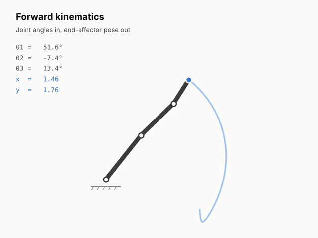
</p>

| Paper | Year | Description | Links |
|-------|------|-------------|-------|
| Denavit-Hartenberg Notation | 1955 | Introduces the four-parameter matrix notation for lower-pair mechanisms that became the standard way to describe serial robot geometry. | [[JAM]](https://doi.org/10.1115/1.4011045) |
| Pieper's Thesis | 1968 | Shows that a 6-DOF arm with three consecutive intersecting axes has a closed-form inverse kinematic solution, the design rule behind most industrial arms. | [[Thesis]](https://apps.dtic.mil/sti/citations/AD0680036) |
| Product of Exponentials | 1984 | Writes forward kinematics as a product of matrix exponentials of joint twists, removing the need for link frames. | [[Springer]](https://doi.org/10.1007/BFb0031048) |
| Khalil-Kleinfinger Notation | 1986 | A modified geometric notation that handles open, tree-structured, and closed-loop robots with one consistent set of parameters. | [[ICRA]](https://doi.org/10.1109/ROBOT.1986.1087552) |
| Computational Aspects of the POE Formula | 1994 | Analyzes the product-of-exponentials formula for efficient forward kinematics and Jacobian computation and compares it with Denavit-Hartenberg models. | [[TAC]](https://doi.org/10.1109/9.280779) |
| A Mathematical Introduction to Robotic Manipulation | 1994 | The textbook that established screw theory and Lie groups as the working language of manipulator kinematics. | [[Book]](https://www.cds.caltech.edu/~murray/mlswiki/index.php/Main_Page) |
| Modern Robotics | 2017 | Textbook and software library that teach kinematics entirely through screws and the product of exponentials. | [[Website]](http://modernrobotics.org) [[GitHub]](https://github.com/NxRLab/ModernRobotics) |

---

### 🔄 Rotation & Pose Representations

> **Rotation and pose representations** decide how orientation errors are measured, interpolated, and differentiated. A poor choice produces gimbal lock in a controller, discontinuities in a learned model, or a wrong gradient in an optimizer.

| Paper | Year | Description | Links |
|-------|------|-------------|-------|
| A Survey of Attitude Representations | 1993 | Reference survey of rotation parameterizations (matrices, Euler angles, quaternions, Rodrigues parameters) and the relations between them. | [[JAS]](https://ui.adsabs.harvard.edu/abs/1993JAnSc..41..439S) |
| Practical Parameterization of Rotations Using the Exponential Map | 1998 | Shows how to use the three-parameter exponential map robustly for inverse kinematics and optimization, including derivative computation near its singularities. | [[JGT]](https://doi.org/10.1080/10867651.1998.10487493) |
| Hand-Eye Calibration Using Dual Quaternions | 1999 | Uses dual quaternions to solve rotation and translation simultaneously, a widely cited demonstration of the representation's value. | [[IJRR]](https://doi.org/10.1177/02783649922066213) |
| Quaternion Kinematics for the Error-State Kalman Filter | 2017 | Self-contained reference on quaternion conventions, perturbations, derivatives, and integration. | [[arXiv]](https://arxiv.org/abs/1711.02508) |
| A Micro Lie Theory for State Estimation in Robotics | 2018 | Compact tutorial on the Lie group operations and Jacobians needed in practice for SO(3) and SE(3). | [[arXiv]](https://arxiv.org/abs/1812.01537) [[GitHub]](https://github.com/artivis/manif) |
| On the Continuity of Rotation Representations in Neural Networks | 2019 | Proves that rotation representations with four or fewer dimensions are discontinuous for learning and proposes continuous 5D and 6D alternatives. | [[arXiv]](https://arxiv.org/abs/1812.07035) |
| An Analysis of SVD for Deep Rotation Estimation | 2020 | Shows that projecting a 9D network output onto SO(3) with the singular value decomposition is a simple and strong rotation head. | [[arXiv]](https://arxiv.org/abs/2006.14616) |
| Deep Regression on Manifolds: A 3D Rotation Case Study | 2021 | Studies differentiable mappings onto rotation manifolds for regression and releases the RoMa rotation library. | [[arXiv]](https://arxiv.org/abs/2103.16317) [[GitHub]](https://github.com/naver/roma) |
| Learning with 3D Rotations: A Hitchhiker's Guide to SO(3) | 2024 | Practical guide to which rotation representation to choose for a learning problem depending on whether rotations are inputs or outputs. | [[arXiv]](https://arxiv.org/abs/2404.11735) |

---

### 🔙 Inverse Kinematics

> **Inverse kinematics** runs the forward map backward: given a desired pose, find the joint values that produce it. The problem may have several solutions, infinitely many, or none, and the three families below differ in how they deal with that.

<p align="center">
  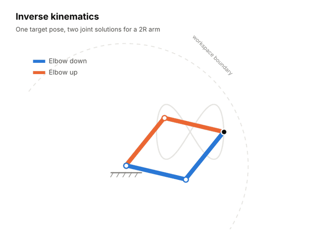
</p>

#### 🧮 Analytical Inverse Kinematics

> **Analytical IK** solves the kinematic equations in closed form. When it exists it is the fastest and most complete option: it returns every solution branch in microseconds, with no initial guess and no convergence failures.

##### 📜 **Classical Closed-Form & General 6R Solutions**

> The general six-revolute arm has up to 16 inverse kinematic solutions. Reducing the problem to a single univariate polynomial was one of the long-standing problems of mechanism theory.

| Paper | Year | Description | Links |
|-------|------|-------------|-------|
| Inverse Kinematics of the General 6R Manipulator | 1993 | Reduces the general 6R problem to a 16th-degree polynomial by dialytic elimination, giving all solutions for arbitrary geometry. | [[JMD]](https://doi.org/10.1115/1.2919218) |
| Efficient Inverse Kinematics for General 6R Manipulators | 1994 | Recasts the Raghavan-Roth elimination as an eigenvalue problem for a numerically robust and fast implementation. | [[TRA]](https://doi.org/10.1109/70.326569) |
| A New and Efficient Algorithm for the General 6R | 2007 | Solves the general 6R inverse kinematics using kinematic mapping and the geometry of the Study quadric. | [[MMT]](https://www.sciencedirect.com/science/article/abs/pii/S0094114X06000310) |
| Analytical IK for 7-DOF Redundant Manipulators | 2008 | Closed-form solution for spherical-revolute-spherical arms parameterized by an arm angle, with joint limits mapped to feasible arm-angle intervals. | [[T-RO]](https://doi.org/10.1109/TRO.2008.2003266) |
| Analytic IK for the Universal Robots UR-5/UR-10 | 2013 | Derives the closed-form solution for the UR family, whose three parallel axes replace the usual spherical wrist. | [[Report]](https://repository.gatech.edu/handle/1853/50782) |
| Position-based Kinematics for 7-DoF Serial Manipulators | 2018 | Analytical solution for 7-DOF arms with global configuration control, joint-limit handling, and singularity avoidance. | [[MMT]](https://doi.org/10.1016/j.mechmachtheory.2017.10.025) |
| Analytical IK for Franka Emika Panda | 2021 | Geometric closed-form solver for the Panda, a 7-DOF arm whose joint offsets break the standard spherical-shoulder assumptions. | [[GitHub]](https://github.com/ffall007/franka_analytical_ik) |

##### 🤖 **Automatic Solver Generation**

> **Solver generators** take a robot description and derive the closed-form solution automatically, so analytical IK no longer requires a hand derivation per robot.

| Paper | Year | Description | Links |
|-------|------|-------------|-------|
| IKFast | 2010 | Analyzes a robot's kinematic equations symbolically and generates C++ code that returns all solutions; introduced with OpenRAVE. | [[Thesis]](https://www.ri.cmu.edu/publications/automated-construction-of-robotic-manipulation-programs/) [[GitHub]](https://github.com/rdiankov/openrave) |
| IKBT | 2017 | Uses a behavior tree to automate symbolic closed-form IK derivation for arms up to 6 DOF, producing a LaTeX report and solver code. | [[arXiv]](https://arxiv.org/abs/1711.05412) [[GitHub]](https://github.com/uw-biorobotics/IKBT) |
| IK-Geo | 2022 | Unifies IK for 6R arms through canonical geometric subproblems: closed-form when three axes intersect or are parallel, and by a low-dimensional search otherwise. | [[arXiv]](https://arxiv.org/abs/2211.05737) [[GitHub]](https://github.com/rpiRobotics/ik-geo) |
| EAIK | 2024 | Automatically decomposes a manipulator's geometry into subproblems to derive analytical IK directly from a URDF or DH table. | [[arXiv]](https://arxiv.org/abs/2409.14815) [[GitHub]](https://github.com/OstermD/EAIK) |

#### 🔁 Numerical & Optimization-based Inverse Kinematics

> **Numerical IK** iterates toward a solution instead of deriving one. It works for any mechanism and any set of constraints, at the price of needing an initial guess and returning one local solution at a time.

<p align="center">
  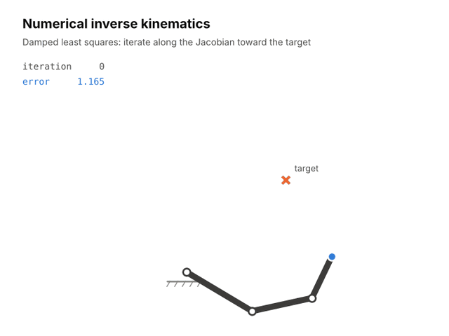
</p>

##### 📉 **Jacobian-based Iterative Methods**

| Paper | Year | Description | Links |
|-------|------|-------------|-------|
| Resolved Motion Rate Control | 1969 | Introduces Jacobian-based coordinated control: commanding end-effector velocity and solving for joint rates. | [[TMMS]](https://doi.org/10.1109/TMMS.1969.299896) |
| Damped Least Squares (Wampler) | 1986 | Adds damping to the pseudoinverse so that joint velocities stay bounded near singularities. | [[SMC]](https://doi.org/10.1109/TSMC.1986.289285) |
| Singularity-Robust Inverse | 1986 | Independently proposes the damped pseudoinverse and analyzes the trade-off between tracking accuracy and feasibility. | [[JDSMC]](https://doi.org/10.1115/1.3143764) |
| Cyclic Coordinate Descent | 1991 | Combines per-joint coordinate descent with a quasi-Newton refinement for fast, derivative-light IK. | [[TRA]](https://doi.org/10.1109/70.86079) |
| Introduction to Inverse Kinematics | 2004 | Widely used tutorial comparing the Jacobian transpose, pseudoinverse, and damped least squares methods. | [[PDF]](https://mathweb.ucsd.edu/~sbuss/ResearchWeb/ikmethods/iksurvey.pdf) |
| Selectively Damped Least Squares | 2005 | Damps each singular direction separately according to how hard it is to reach the target, improving convergence over uniform damping. | [[JGT]](https://doi.org/10.1080/2151237X.2005.10129202) |
| FABRIK | 2011 | Forward and backward reaching IK that works on joint positions along lines instead of rotation angles; popular in animation. | [[GM]](https://doi.org/10.1016/j.gmod.2011.05.003) |
| Solvability-Unconcerned IK | 2011 | Levenberg-Marquardt IK with a robust damping rule that converges whether or not the target is reachable. | [[T-RO]](https://doi.org/10.1109/TRO.2011.2148230) |
| Manipulator Differential Kinematics, Part I | 2022 | Tutorial that derives numerical IK and resolved-rate control from the elementary transform sequence, with runnable notebooks. | [[arXiv]](https://arxiv.org/abs/2207.01796) [[GitHub]](https://github.com/jhavl/dkt) |

##### 🎚 **Optimization-based & Multi-Objective IK**

| Paper | Year | Description | Links |
|-------|------|-------------|-------|
| TRAC-IK | 2015 | Runs a Newton solver with random restarts concurrently with sequential quadratic programming, substantially raising solve rates under joint limits. | [[Humanoids]](https://doi.org/10.1109/HUMANOIDS.2015.7363472) [[Bitbucket]](https://bitbucket.org/traclabs/trac_ik) |
| RelaxedIK | 2018 | Treats pose matching as one weighted objective among several, yielding smooth motion free of self-collisions and singularities. | [[RSS]](https://doi.org/10.15607/RSS.2018.XIV.043) [[GitHub]](https://github.com/uwgraphics/relaxed_ik) |
| BioIK | 2019 | Memetic algorithm combining evolutionary and particle swarm search with gradient steps for full-body IK with arbitrary goal types. | [[TEVC]](https://doi.org/10.1109/TEVC.2018.2867601) [[GitHub]](https://github.com/TAMS-Group/bio_ik) |
| Global IK via Mixed-Integer Convex Optimization | 2019 | Relaxes the rotation constraints into a mixed-integer convex program that finds a solution or certifies infeasibility. | [[IJRR]](https://doi.org/10.1177/0278364919846512) |
| CollisionIK | 2021 | Per-instant pose optimization that avoids static and dynamic obstacles while matching end-effector goals. | [[arXiv]](https://arxiv.org/abs/2102.13187) |
| Riemannian Optimization for Distance-Geometric IK | 2021 | Reformulates IK as a low-rank distance matrix completion problem solved on a Riemannian manifold. | [[arXiv]](https://arxiv.org/abs/2108.13720) |
| Convex Iteration for Distance-Geometric IK | 2021 | Solves the distance-geometric IK formulation by a sequence of semidefinite programs. | [[arXiv]](https://arxiv.org/abs/2109.03374) |
| RangedIK | 2023 | Extends RelaxedIK with tolerance ranges on task degrees of freedom so that spare freedom is used for smoothness and feasibility. | [[arXiv]](https://arxiv.org/abs/2302.13935) [[GitHub]](https://github.com/uwgraphics/relaxed_ik_core) |
| PyRoki | 2025 | Modular, differentiable kinematic optimization toolkit in JAX covering IK, motion retargeting, and trajectory optimization on CPU and GPU. | [[arXiv]](https://arxiv.org/abs/2505.03728) [[GitHub]](https://github.com/chungmin99/pyroki) |

#### 🎲 Learning-based Inverse Kinematics

> **Learned IK** trains a model to propose joint solutions. It produces many diverse candidates in one batched forward pass, which suits redundant arms and planners that need seeds; the candidates are approximate and are usually polished with a numerical step.

| Paper | Year | Description | Links |
|-------|------|-------------|-------|
| Learning Inverse Kinematics | 2001 | Learns IK for a redundant humanoid arm locally at the velocity level with locally weighted regression, sidestepping the non-convexity of the solution set. | [[IROS]](https://doi.org/10.1109/IROS.2001.973374) |
| Analyzing Inverse Problems with Invertible Neural Networks | 2018 | Introduces invertible networks for ambiguous inverse problems and uses planar-arm inverse kinematics as a test case. | [[arXiv]](https://arxiv.org/abs/1808.04730) |
| Learning Constrained Distributions of Robot Configurations | 2021 | Trains a generative adversarial network to sample configurations satisfying kinematic constraints, used to seed IK and planning. | [[arXiv]](https://arxiv.org/abs/2011.05717) |
| IKFlow | 2022 | Conditional normalizing flow that generates diverse solutions covering the full self-motion manifold of redundant arms. | [[arXiv]](https://arxiv.org/abs/2111.08933) [[GitHub]](https://github.com/jstmn/ikflow) |
| Neural Inverse Kinematics | 2022 | Hierarchical hypernetwork that models the conditional distribution of each joint given the previous ones along the chain. | [[arXiv]](https://arxiv.org/abs/2205.10837) |
| Generative Graphical Inverse Kinematics | 2022 | Graph neural network that generates IK solutions in a distance-geometric representation and generalizes across different manipulators. | [[arXiv]](https://arxiv.org/abs/2209.08812) |
| CycleIK | 2023 | Neuro-inspired IK using a GAN and an MLP that can be combined with SLSQP or genetic optimization, evaluated on the NICOL semi-humanoid robot. | [[arXiv]](https://arxiv.org/abs/2307.11554) |

---

### 📈 Differential Kinematics, Redundancy & Singularities

> **Differential kinematics** works at the velocity level, where the map from joints to task is linear. It is the natural setting for real-time control, for using spare degrees of freedom, and for understanding the configurations where a mechanism loses mobility. Its central object is the Jacobian, introduced in [The Jacobian Matrix](#the-jacobian-matrix).

#### 🧭 **Manipulability & Singularities**

<p align="center">
  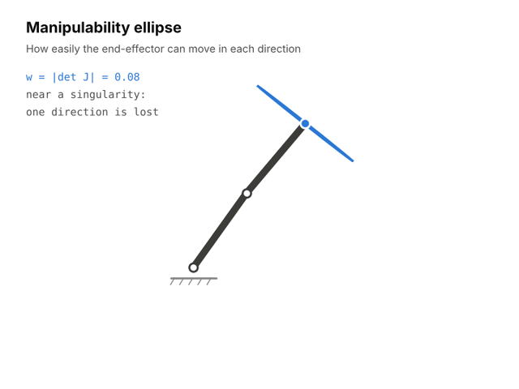
</p>

| Paper | Year | Description | Links |
|-------|------|-------------|-------|
| Articulated Hands: Force Control and Kinematic Issues | 1982 | Introduces the Jacobian condition number as a measure of kinematic accuracy and isotropy. | [[IJRR]](https://doi.org/10.1177/027836498200100102) |
| Manipulability of Robotic Mechanisms | 1985 | Defines the manipulability ellipsoid and measure, the most widely used index of distance from singularity. | [[IJRR]](https://doi.org/10.1177/027836498500400201) |
| Dexterity Measures for Redundant Manipulators | 1987 | Compares determinant, condition number, minimum singular value, and joint-range measures for design and control. | [[IJRR]](https://doi.org/10.1177/027836498700600206) |
| Singularity Analysis of Closed-Loop Kinematic Chains | 1990 | Classifies singularities into three types using the two Jacobians of a closed chain; the standard taxonomy for parallel robots. | [[TRA]](https://doi.org/10.1109/70.56660) |
| Geometry-Aware Manipulability Learning, Tracking and Transfer | 2021 | Treats manipulability ellipsoids as points on the manifold of symmetric positive definite matrices to learn and track them. | [[arXiv]](https://arxiv.org/abs/1811.11050) |
| Manipulator Differential Kinematics, Part II | 2022 | Tutorial on the manipulator Hessian, higher-order derivatives, and their use in manipulability-maximizing control. | [[arXiv]](https://arxiv.org/abs/2207.01794) [[GitHub]](https://github.com/jhavl/dkt) |

#### 🧩 **Redundancy Resolution & Task Priority**

<p align="center">
  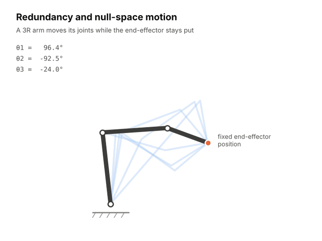
</p>

| Paper | Year | Description | Links |
|-------|------|-------------|-------|
| Automatic Supervisory Control of Multibody Mechanisms | 1977 | Introduces null-space projection of a secondary objective gradient, the basis of redundancy resolution. | [[SMC]](https://doi.org/10.1109/TSMC.1977.4309644) |
| Review of Pseudoinverse Control | 1983 | Analyzes pseudoinverse control of redundant manipulators, including its non-repeatability over closed paths. | [[SMC]](https://doi.org/10.1109/TSMC.1983.6313123) |
| Operational Space Formulation | 1987 | Unified framework for motion and force control in task space, including the dynamically consistent treatment of redundancy. | [[JRA]](https://doi.org/10.1109/JRA.1987.1087068) |
| Task-Priority Based Redundancy Control | 1987 | Formalizes executing a secondary task only in the null space of a primary one. | [[IJRR]](https://doi.org/10.1177/027836498700600201) |
| A General Framework for Managing Multiple Tasks | 1991 | Recursive formulation extending task priority to any number of levels for highly redundant systems. | [[ICAR]](https://doi.org/10.1109/ICAR.1991.240390) |
| Singularity-Robust Task-Priority Redundancy Resolution | 1997 | Decouples task levels to avoid the algorithmic singularities that arise when tasks conflict. | [[TRA]](https://doi.org/10.1109/70.585902) |
| Generalizing Task Priority to Inequality Tasks | 2011 | Extends the prioritized framework to inequality constraints by solving a sequence of quadratic programs. | [[T-RO]](https://doi.org/10.1109/TRO.2011.2142450) |
| Hierarchical Quadratic Programming | 2014 | Dedicated solver for strict hierarchies of equality and inequality tasks, fast enough for online humanoid motion generation. | [[IJRR]](https://doi.org/10.1177/0278364914521306) |
| Saturation in the Null Space | 2015 | Handles hard joint position, velocity, and acceleration bounds by saturating joints one at a time and redistributing motion. | [[T-RO]](https://doi.org/10.1109/TRO.2015.2418582) |
| NEO | 2021 | Reactive velocity controller posed as a QP that avoids obstacles and joint limits while maximizing manipulability. | [[arXiv]](https://arxiv.org/abs/2010.08686) |
| A Holistic Approach to Reactive Mobile Manipulation | 2022 | Treats a mobile base and arm as one kinematic chain in a reactive QP controller for motion on the move. | [[arXiv]](https://arxiv.org/abs/2109.04749) |

---

### 🪞 Learned Kinematic Models & Self-Modeling

> **Learned kinematic models** replace or augment the analytic model with data. They describe robots whose geometry is unknown, soft, or changing, and they let a robot recover or recalibrate its own model from what it sees. For learned inverse kinematics, see [Learning-based Inverse Kinematics](#-learning-based-inverse-kinematics).

| Paper | Year | Description | Links |
|-------|------|-------------|-------|
| Resilient Machines Through Continuous Self-Modeling | 2006 | A legged robot infers its own structure from sensorimotor data and re-models itself after damage. | [[Science]](https://doi.org/10.1126/science.1133687) |
| Camera-to-Robot Pose Estimation from a Single Image (DREAM) | 2020 | Detects robot keypoints in an RGB image and recovers the camera-to-robot transform, enabling markerless online calibration. | [[arXiv]](https://arxiv.org/abs/1911.09231) [[GitHub]](https://github.com/NVlabs/DREAM) |
| RoboPose | 2021 | Render-and-compare estimation of a robot's 6D pose and joint angles from a single image. | [[arXiv]](https://arxiv.org/abs/2104.09359) |
| Full-Body Visual Self-Modeling of Robot Morphologies | 2022 | Learns an implicit query-based model of the space a robot occupies as a function of its joint state, usable for planning. | [[arXiv]](https://arxiv.org/abs/2111.06389) |
| Neural Jacobian Fields | 2024 | Learns a dense 3D field mapping motor commands to motion from video alone, enabling closed-loop control of soft and unconventional robots with one camera. | [[arXiv]](https://arxiv.org/abs/2407.08722) |

---

### ⚡ Differentiable & GPU-Accelerated Kinematics

> **Differentiable kinematics** exposes forward kinematics and its derivatives to optimizers and learning frameworks. Batching the same computation on a GPU turns IK from one query at a time into thousands in parallel.

| Paper | Year | Description | Links |
|-------|------|-------------|-------|
| Analytical Derivatives of Rigid Body Dynamics Algorithms | 2018 | Derives exact, efficient derivatives of the recursive rigid-body algorithms, far faster than finite differences or automatic differentiation. | [[RSS]](https://doi.org/10.15607/RSS.2018.XIV.038) |
| Pinocchio | 2019 | Fast C++ library for rigid-body kinematics and dynamics and their analytical derivatives, with Python bindings. | [[SII]](https://doi.org/10.1109/SII.2019.8700380) [[GitHub]](https://github.com/stack-of-tasks/pinocchio) |
| Theseus | 2022 | Differentiable nonlinear least squares in PyTorch with Lie groups and differentiable forward kinematics. | [[arXiv]](https://arxiv.org/abs/2207.09442) [[GitHub]](https://github.com/facebookresearch/theseus) |
| PyPose | 2023 | PyTorch library for Lie-group operations and second-order optimization in robotics. | [[arXiv]](https://arxiv.org/abs/2209.15428) [[GitHub]](https://github.com/pypose/pypose) |
| cuRobo | 2023 | GPU-parallel kinematics, collision checking, and optimization that solves collision-free IK and motion generation in milliseconds. | [[arXiv]](https://arxiv.org/abs/2310.17274) [[GitHub]](https://github.com/NVlabs/curobo) |
| Differentiable Robot Rendering | 2024 | Makes a robot's rendered appearance differentiable with respect to its joint angles, connecting image-space losses to kinematic control. | [[arXiv]](https://arxiv.org/abs/2410.13851) |

---

### 🕸 Parallel & Closed-Chain Mechanisms

> **Parallel robots** connect the end-effector to the base through several chains. Their inverse kinematics is usually trivial; their forward kinematics and singularity structure are among the hardest problems in the field.

<p align="center">
  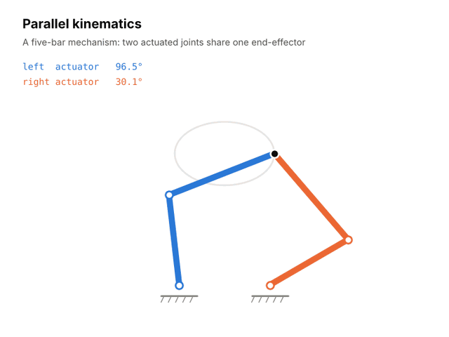
</p>

| Paper | Year | Description | Links |
|-------|------|-------------|-------|
| A Platform with Six Degrees of Freedom | 1965 | Proposes the six-legged parallel platform for flight simulation that, with Gough's earlier tire-testing machine, gave the Gough-Stewart platform its name. | [[IMechE]](https://doi.org/10.1243/PIME_PROC_1965_180_029_02) |
| The Stewart Platform of General Geometry Has 40 Configurations | 1993 | Shows numerically that the forward kinematics of the general Gough-Stewart platform has 40 solutions in the complex domain. | [[JMD]](https://doi.org/10.1115/1.2919188) |
| An Algorithm for Solving the Direct Kinematics of General Stewart-Gough Platforms | 1996 | Derives the 40th-degree univariate polynomial for the forward kinematics using kinematic mapping. | [[MMT]](https://doi.org/10.1016/0094-114X%2895%2900091-C) |
| The Stewart-Gough Platform of General Geometry Can Have 40 Real Postures | 1998 | Constructs a platform geometry for which all 40 forward kinematic solutions are real. | [[Springer]](https://doi.org/10.1007/978-94-015-9064-8_1) |
| Constraint Singularities of Parallel Mechanisms | 2002 | Identifies a class of singularities in lower-mobility parallel mechanisms where the platform gains unwanted degrees of freedom. | [[ICRA]](https://espace2.etsmtl.ca/id/eprint/9908/) |
| Parallel Robots | 2006 | The reference monograph on parallel robot architectures, kinematics, singularities, workspace, and calibration. | [[Springer]](https://doi.org/10.1007/1-4020-4133-0) |

---

### 🚗 Mobile Robot Kinematics

> **Mobile robot kinematics** is governed by rolling constraints. Because a wheel cannot slip sideways, the robot can reach any pose in the plane but cannot move in every direction at every instant.

<p align="center">
  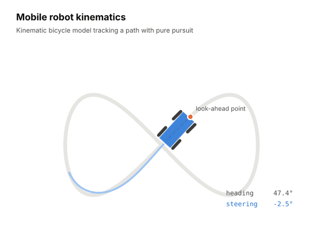
</p>

| Paper | Year | Description | Links |
|-------|------|-------------|-------|
| Dubins Curves | 1957 | Proves that the shortest path for a forward-only vehicle with bounded curvature consists of circular arcs and straight segments. | [[AJM]](https://doi.org/10.2307/2372560) |
| Kinematic Modeling of Wheeled Mobile Robots | 1987 | Systematic methodology for modeling wheeled robots with conventional, omnidirectional, and ball wheels. | [[JRS]](https://doi.org/10.1002/rob.4620040209) |
| Reeds-Shepp Curves | 1990 | Extends Dubins' result to a car that can also reverse, characterizing the shortest paths with cusps. | [[PJM]](https://doi.org/10.2140/pjm.1990.145.367) |
| A Stable Tracking Control Method for an Autonomous Mobile Robot | 1990 | Classic kinematic trajectory-tracking law for unicycle-type robots with a Lyapunov stability proof. | [[ICRA]](https://doi.org/10.1109/ROBOT.1990.126006) |
| Pure Pursuit | 1992 | Geometric path tracker that steers along the arc joining the vehicle to a look-ahead point on the path. | [[Report]](https://www.ri.cmu.edu/publications/implementation-of-the-pure-pursuit-path-tracking-algorithm/) |
| Nonholonomic Motion Planning: Steering Using Sinusoids | 1993 | Steers nonholonomic systems in chained form using sinusoidal inputs, linking wheeled-robot kinematics to geometric control. | [[TAC]](https://doi.org/10.1109/9.277235) |
| Structural Properties and Classification of Wheeled Mobile Robots | 1996 | Classifies all wheeled mobile robots into five types by their degrees of mobility and steerability. | [[TRA]](https://doi.org/10.1109/70.481750) |
| Kinematic and Dynamic Vehicle Models for Autonomous Driving | 2015 | Compares kinematic and dynamic bicycle models for model predictive control and shows when the kinematic one suffices. | [[IV]](https://doi.org/10.1109/IVS.2015.7225830) |
| The Kinematic Bicycle Model: A Consistent Model for Planning? | 2017 | Quantifies the lateral-acceleration range within which the kinematic bicycle model remains valid for trajectory planning. | [[IV]](https://doi.org/10.1109/IVS.2017.7995816) |

---

### 🦿 Legged & Humanoid Whole-Body Kinematics

> **Whole-body kinematics** treats a legged robot as a tree attached to a free-floating base. Balance, foot contacts, hand goals, and joint limits all compete for the same joints, so the problem is to satisfy many tasks at once.

| Paper | Year | Description | Links |
|-------|------|-------------|-------|
| Resolved Momentum Control | 2003 | Generates humanoid whole-body motion by specifying desired linear and angular momentum and resolving it into joint velocities. | [[IROS]](https://doi.org/10.1109/IROS.2003.1248880) |
| Synthesis of Whole-Body Behaviors | 2005 | Composes prioritized behavioral primitives for humanoids through recursive null-space projections. | [[IJHR]](https://doi.org/10.1142/S0219843605000594) |
| Stack of Tasks | 2009 | Software framework implementing generalized inverted kinematics with a prioritized, reconfigurable task stack for humanoids. | [[ICAR]](https://ieeexplore.ieee.org/document/5174677) [[GitHub]](https://github.com/stack-of-tasks/sot-core) |
| State Estimation for Legged Robots | 2012 | Fuses leg forward kinematics with inertial measurements in an EKF to estimate base pose without assumptions on terrain. | [[RSS]](https://doi.org/10.15607/RSS.2012.VIII.003) |
| Centroidal Dynamics of a Humanoid Robot | 2013 | Defines the centroidal momentum matrix that maps joint velocities to whole-body momentum. | [[AURO]](https://doi.org/10.1007/s10514-013-9341-4) |
| Whole-Body Motion Planning with Centroidal Dynamics and Full Kinematics | 2014 | Combines a simple dynamics model with the full kinematic model to plan dynamic humanoid motions. | [[Humanoids]](https://doi.org/10.1109/HUMANOIDS.2014.7041375) |
| Contact-Aided Invariant EKF | 2020 | Uses Lie-group symmetry and leg kinematics with contact for a legged state estimator with improved convergence. | [[arXiv]](https://arxiv.org/abs/1904.09251) [[GitHub]](https://github.com/RossHartley/invariant-ekf) |

---

### 🕺 Motion Retargeting

> **Motion retargeting** transfers a motion from one body to another with different proportions or structure. It is inverse kinematics with a moving, whole-body target, and it is now the main source of reference motion for humanoid and dexterous-hand learning.

| Paper | Year | Description | Links |
|-------|------|-------------|-------|
| Retargetting Motion to New Characters | 1998 | Formulates retargeting as a spacetime constraint optimization that preserves key features of the original motion. | [[SIGGRAPH]](https://doi.org/10.1145/280814.280820) |
| Neural Kinematic Networks | 2018 | Recurrent network with a differentiable forward kinematics layer trained without paired data to retarget motion between skeletons. | [[arXiv]](https://arxiv.org/abs/1804.05653) |
| DexPilot | 2019 | Vision-based teleoperation that retargets a bare human hand to a dexterous robot hand with a fingertip-distance cost. | [[arXiv]](https://arxiv.org/abs/1910.03135) |
| Skeleton-Aware Networks | 2020 | Skeletal convolution and pooling operators that retarget motion between skeletons with different structures (numbers of joints) without paired data. | [[arXiv]](https://arxiv.org/abs/2005.05732) |
| HybrIK | 2021 | Hybrid analytical-neural inverse kinematics using twist-and-swing decomposition to recover body pose from 3D joints. | [[arXiv]](https://arxiv.org/abs/2011.14672) [[GitHub]](https://github.com/Jeff-sjtu/HybrIK) |
| AnyTeleop | 2023 | General vision-based dexterous teleoperation system whose retargeting module supports many arm and hand models. | [[arXiv]](https://arxiv.org/abs/2307.04577) [[GitHub]](https://github.com/dexsuite/dex-retargeting) |
| GMR | 2025 | General motion retargeting for humanoids that studies how retargeting quality affects downstream motion-tracking policies. | [[arXiv]](https://arxiv.org/abs/2510.02252) [[GitHub]](https://github.com/YanjieZe/GMR) |

---

### 🐍 Continuum & Soft Robot Kinematics

> **Continuum robots** bend along their whole length. Their kinematics maps actuator inputs (tendon lengths, tube rotations, chamber pressures) to a backbone shape, and for soft or slender robots that shape depends on elasticity and external loads as well as geometry.

<p align="center">
  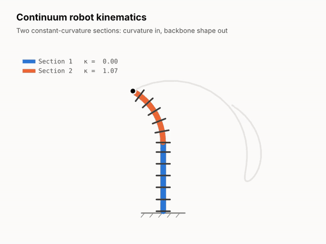
</p>

| Paper | Year | Description | Links |
|-------|------|-------------|-------|
| A Modal Approach to Hyper-Redundant Manipulator Kinematics | 1994 | Describes a hyper-redundant arm by a backbone curve expressed in a small set of shape modes. | [[TRA]](https://doi.org/10.1109/70.294209) |
| Kinematics of an Elephant's Trunk Manipulator | 2003 | Develops and experimentally validates constant-curvature section kinematics on a tendon-driven trunk robot. | [[JRS]](https://doi.org/10.1002/rob.10070) |
| Kinematics for Multisection Continuum Robots | 2006 | Modular formulation of multisection constant-curvature kinematics that handles the straight-section singularity. | [[T-RO]](https://doi.org/10.1109/TRO.2005.861458) |
| Design and Control of Concentric-Tube Robots | 2010 | Derives the kinematics of precurved concentric tubes including torsion and uses it for real-time position control. | [[T-RO]](https://doi.org/10.1109/TRO.2009.2035740) |
| Geometrically Exact Model for Externally Loaded Concentric-Tube Robots | 2010 | Cosserat rod model predicting concentric-tube shape under external forces and moments. | [[T-RO]](https://doi.org/10.1109/TRO.2010.2062570) |
| Constant Curvature Continuum Robots: A Review | 2010 | Unifies the constant-curvature literature into robot-specific and robot-independent kinematic mappings. | [[IJRR]](https://doi.org/10.1177/0278364910368147) |
| Discrete Cosserat Approach for Multisection Soft Manipulator Dynamics | 2018 | Piecewise constant strain model that generalizes rigid-robot screw-theoretic recursion to soft manipulators. | [[T-RO]](https://doi.org/10.1109/TRO.2018.2868815) |
| An Improved State Parametrization for Piecewise Constant Curvature | 2020 | Proposes a singularity-free parameterization for piecewise constant curvature soft robots suited to model-based control. | [[RA-L]](https://doi.org/10.1109/LRA.2020.2967269) |
| Soft Robots Modeling: A Structured Overview | 2023 | Organizes soft robot models (continuum mechanics, geometric, discrete material, surrogate) in a common framework. | [[arXiv]](https://arxiv.org/abs/2112.03645) |

---

### 🎯 Kinematic Calibration & Hand-Eye

> **Kinematic calibration** identifies the geometric parameters a real robot actually has. A robot is typically far more repeatable than it is accurate; calibration closes that gap, and hand-eye calibration ties the kinematic model to the robot's sensors.

#### 📏 **Geometric Parameter Identification**

| Paper | Year | Description | Links |
|-------|------|-------------|-------|
| Robot Arm Geometric Link Parameter Estimation | 1983 | Adds a rotation parameter for consecutive near-parallel axes, fixing the ill-conditioning of DH parameters in calibration. | [[CDC]](https://doi.org/10.1109/CDC.1983.269783) |
| Optimal Measurement Configurations Based on Observability Measure | 1991 | Proposes an observability index for choosing the measurement configurations that best excite the parameter errors. | [[IJRR]](https://doi.org/10.1177/027836499101000106) |
| Identifiable Parameters and Optimum Configurations | 1991 | Determines which geometric parameters are identifiable and how to select configurations that condition the problem well. | [[Robotica]](https://doi.org/10.1017/S0263574700015575) |
| A Complete and Parametrically Continuous Kinematic Model | 1992 | Introduces the CPC model, in which small geometric changes always correspond to small parameter changes. | [[TRA]](https://doi.org/10.1109/70.149944) |
| Kinematic Calibration Using the Product of Exponentials Formula | 1996 | Shows that the POE model gives a smooth, singularity-free parameterization for calibration. | [[Robotica]](https://doi.org/10.1017/S0263574700019810) |
| The Calibration Index and Taxonomy | 1996 | Classifies calibration methods by the number of sensed and constrained degrees of freedom at the end-effector. | [[IJRR]](https://doi.org/10.1177/027836499601500604) |
| Absolute Calibration of an ABB IRB 1600 Using a Laser Tracker | 2013 | Full geometric and compliance calibration of an industrial arm with reported accuracy before and after. | [[RCIM]](https://doi.org/10.1016/j.rcim.2012.06.004) |

#### 👁 **Hand-Eye Calibration**

| Paper | Year | Description | Links |
|-------|------|-------------|-------|
| Tsai-Lenz | 1989 | Efficient two-stage solution of the hand-eye equation AX = XB, rotation first and then translation. | [[TRA]](https://doi.org/10.1109/70.34770) |
| Park-Martin | 1994 | Closed-form least-squares solution of AX = XB on the Euclidean group using Lie-group logarithms. | [[TRA]](https://doi.org/10.1109/70.326576) |
| Daniilidis | 1999 | Solves rotation and translation simultaneously with dual quaternions and a singular value decomposition. | [[IJRR]](https://doi.org/10.1177/02783649922066213) |

---

### 🌐 Workspace, Reachability & Dexterity

> **Workspace analysis** asks where a robot can reach and how well it can move once there. The answers drive robot design, cell layout, base placement, and grasp selection.

| Paper | Year | Description | Links |
|-------|------|-------------|-------|
| The Workspaces of a Mechanical Manipulator | 1981 | Defines reachable and dexterous workspaces and studies how link geometry shapes them. | [[JMD]](https://doi.org/10.1115/1.3254968) |
| Design Considerations for Manipulator Workspace | 1982 | Relates workspace shape, voids, and approach angles to the kinematic design of the arm and hand. | [[JMD]](https://doi.org/10.1115/1.3256412) |
| A Global Performance Index for Kinematic Optimization | 1991 | Integrates the Jacobian condition number over the workspace into a single global conditioning index for design. | [[JMD]](https://doi.org/10.1115/1.2912772) |
| Capturing Robot Workspace Structure | 2007 | Introduces the capability map, a discretized representation of the directions from which each workspace region can be reached. | [[IROS]](https://doi.org/10.1109/IROS.2007.4399105) |
| Robot Placement Based on Reachability Inversion | 2013 | Inverts a reachability map to find base poses from which a target grasp is reachable. | [[ICRA]](https://doi.org/10.1109/ICRA.2013.6630839) |
| Manipulator Performance Measures: A Comprehensive Literature Survey | 2015 | Surveys local and global kinematic performance indices and their limitations. | [[JINT]](https://doi.org/10.1007/s10846-014-0024-y) |
| Reuleaux | 2018 | Open-source reachability-map generation and robot base placement for task sequences. | [[arXiv]](https://arxiv.org/abs/1710.01328) [[GitHub]](https://github.com/ros-industrial-attic/reuleaux) |

---

## 📊 Benchmarks & Evaluation

Kinematics has no single leaderboard comparable to those in perception. Evaluation rests on shared robot models, shared motion data, and a small set of standard measures.

### Robot Model Collections

| Collection | Format | Contents | Links |
|------------|--------|----------|-------|
| robot_descriptions.py | URDF, MJCF | Python loader for a large curated set of robot descriptions | [[GitHub]](https://github.com/robot-descriptions/robot_descriptions.py) |
| Awesome Robot Descriptions | URDF, MJCF, Xacro | Curated index of robot description repositories | [[GitHub]](https://github.com/robot-descriptions/awesome-robot-descriptions) |
| MuJoCo Menagerie | MJCF | High-quality, quality-checked models of arms, hands, quadrupeds, and humanoids | [[GitHub]](https://github.com/google-deepmind/mujoco_menagerie) |
| example-robot-data | URDF, SRDF | Robot models used in the Pinocchio and Gepetto ecosystem | [[GitHub]](https://github.com/Gepetto/example-robot-data) |
| URDF Files Dataset | URDF | Collection of URDF files gathered from many sources for tool testing | [[GitHub]](https://github.com/Daniella1/urdf_files_dataset) |

### Motion Datasets

| Dataset | Year | Contents | Used For | Links |
|---------|------|----------|----------|-------|
| CMU Graphics Lab Motion Capture Database | 2003 | Optical motion capture of a wide range of human activities | Retargeting, whole-body IK | [[Website]](http://mocap.cs.cmu.edu/) |
| Human3.6M | 2014 | 3.6 million human poses with synchronized video | Pose estimation, human kinematics | [[TPAMI]](https://doi.org/10.1109/TPAMI.2013.248) |
| AMASS | 2019 | Unifies many motion capture datasets in a common body model | Humanoid motion retargeting and tracking | [[arXiv]](https://arxiv.org/abs/1904.03278) [[Website]](https://amass.is.tue.mpg.de/) |
| LAFAN1 | 2020 | High-quality locomotion and action capture released with a motion in-betweening study | Retargeting, motion synthesis | [[GitHub]](https://github.com/ubisoft/ubisoft-laforge-animation-dataset) |

### Standards & Benchmark Suites

| Resource | Description | Links |
|----------|-------------|-------|
| ISO 9283 | Performance criteria and test methods for industrial manipulators, including pose accuracy and repeatability. | [[ISO]](https://www.iso.org/standard/22244.html) |
| MotionBenchMaker | Tool for generating and benchmarking manipulation motion planning datasets across robots and scenes. | [[arXiv]](https://arxiv.org/abs/2112.06402) [[GitHub]](https://github.com/KavrakiLab/motion_bench_maker) |
| ik_benchmarking | Utilities for benchmarking MoveIt inverse kinematics plugins on success rate and solve time. | [[GitHub]](https://github.com/PickNikRobotics/ik_benchmarking) |

### Metrics

| Metric | Measures | Used For |
|--------|----------|----------|
| **Position Error** | Distance between achieved and target end-effector position | IK accuracy |
| **Orientation Error** | Geodesic angle between achieved and target orientation | IK accuracy |
| **Success (Solve) Rate** | Fraction of random reachable targets solved within tolerance and limits | Solver reliability |
| **Solve Time** | Time per query, or queries per second for batched solvers | Real-time suitability |
| **Solution Count / Diversity** | Number of distinct solutions; coverage of the self-motion manifold | Analytical and generative IK |
| **Manipulability / Condition Number** | Distance from singularity and isotropy of the Jacobian | Dexterity, design, redundancy resolution |
| **Joint-Limit Margin** | Distance of the solution from joint limits | Solution quality |
| **Joint Velocity / Jerk** | Smoothness of consecutive solutions | Teleoperation and tracking |
| **Pose Accuracy / Repeatability** | Deviation from commanded pose, and spread over repeated visits (ISO 9283) | Calibration and hardware qualification |
| **Residual After Calibration** | Remaining error on held-out measurement poses | Calibration quality |

---

## 🧰 Open-Source Frameworks

### Kinematics & Rigid-Body Libraries

| Framework | Language | Description | Links |
|-----------|----------|-------------|-------|
| Pinocchio | C++, Python | Fast rigid-body kinematics and dynamics with analytical derivatives. | [[GitHub]](https://github.com/stack-of-tasks/pinocchio) |
| Drake | C++, Python | Multibody modeling with nonlinear, differential, and global inverse kinematics. | [[GitHub]](https://github.com/RobotLocomotion/drake) |
| MuJoCo | C, Python | Physics engine whose kinematics, Jacobians, and models underpin much of current robot learning. | [[GitHub]](https://github.com/google-deepmind/mujoco) |
| Orocos KDL | C++, Python | Kinematic chains and classic FK, IK, and Jacobian solvers; the long-time ROS default. | [[GitHub]](https://github.com/orocos/orocos_kinematics_dynamics) |
| RBDL | C++, Python | Rigid body dynamics library implementing Featherstone's algorithms, with kinematics and IK. | [[GitHub]](https://github.com/rbdl/rbdl) |
| DART | C++, Python | Kinematics and dynamics in generalized coordinates with accurate Jacobians. | [[GitHub]](https://github.com/dartsim/dart) |
| iDynTree | C++, Python, MATLAB | Multibody kinematics and dynamics for floating-base robots, with identification tools. | [[GitHub]](https://github.com/gbionics/idyntree) |
| Klampt | C++, Python | Modeling, kinematics, planning, and simulation toolkit with a compact IK interface. | [[GitHub]](https://github.com/krishauser/Klampt) |
| Robotics Toolbox for Python | Python | Teaching and research toolbox with DH, ETS, and URDF models and many IK solvers. | [[GitHub]](https://github.com/petercorke/robotics-toolbox-python) |
| Modern Robotics | Python, MATLAB, Mathematica | Reference implementations of the screw-theoretic algorithms from the textbook. | [[GitHub]](https://github.com/NxRLab/ModernRobotics) |
| OpenRAVE | C++, Python | Planning environment that includes the IKFast analytical solver generator. | [[GitHub]](https://github.com/rdiankov/openrave) |
| MoveIt 2 | C++, Python | ROS 2 manipulation framework with a plugin interface for kinematics solvers. | [[GitHub]](https://github.com/moveit/moveit2) |

### Inverse Kinematics Solvers

| Solver | Approach | Description | Links |
|--------|----------|-------------|-------|
| TRAC-IK | Newton plus SQP | Drop-in replacement for KDL's IK with better handling of joint limits. | [[Bitbucket]](https://bitbucket.org/traclabs/trac_ik) |
| bio_ik | Memetic optimization | MoveIt plugin for multi-goal IK on arbitrary kinematic trees. | [[GitHub]](https://github.com/TAMS-Group/bio_ik) |
| pick_ik | Gradient plus memetic | MoveIt 2 kinematics plugin with configurable cost functions. | [[GitHub]](https://github.com/PickNikRobotics/pick_ik) |
| Pink | Differential IK (QP) | Weighted-task inverse kinematics built on Pinocchio. | [[GitHub]](https://github.com/pink-kinematics/pink) |
| mink | Differential IK (QP) | Weighted-task inverse kinematics built on MuJoCo. | [[GitHub]](https://github.com/kevinzakka/mink) |
| PlaCo | Whole-body QP | Task-space planning and control for legged and wheeled robots on Pinocchio. | [[GitHub]](https://github.com/Rhoban/placo) |
| TSID | Task-space inverse dynamics | Prioritized whole-body control formulated as QPs on Pinocchio. | [[GitHub]](https://github.com/stack-of-tasks/tsid) |
| relaxed_ik_core | Weighted optimization | Rust core of RelaxedIK, RangedIK, and CollisionIK. | [[GitHub]](https://github.com/uwgraphics/relaxed_ik_core) |
| EAIK | Analytical | Closed-form IK by automatic subproblem decomposition. | [[GitHub]](https://github.com/OstermD/EAIK) |
| IKPy | Numerical | Lightweight pure-Python IK from URDF or DH descriptions. | [[GitHub]](https://github.com/Phylliade/ikpy) |
| cuRobo | GPU optimization | Batched collision-aware IK and motion generation. | [[GitHub]](https://github.com/NVlabs/curobo) |
| PyRoki | JAX least squares | Modular kinematic optimization for IK, retargeting, and trajectories. | [[GitHub]](https://github.com/chungmin99/pyroki) |
| pytorch_kinematics | Differentiable, batched | Parallel forward kinematics, Jacobians, and IK in PyTorch. | [[GitHub]](https://github.com/UM-ARM-Lab/pytorch_kinematics) |

### Geometry, Transform & Model Tools

| Library | Purpose | Description | Links |
|---------|---------|-------------|-------|
| Sophus | Lie groups (C++) | SO(3), SE(3), and Sim(3) for geometry on manifolds. | [[GitHub]](https://github.com/strasdat/Sophus) |
| manif | Lie groups (C++, Python) | Small header-only Lie theory library with analytic Jacobians. | [[GitHub]](https://github.com/artivis/manif) |
| jaxlie | Lie groups (JAX) | Rigid transforms and Lie groups for differentiable programming. | [[GitHub]](https://github.com/brentyi/jaxlie) |
| RoMa | Rotations (PyTorch) | Differentiable rotation representations and conversions. | [[GitHub]](https://github.com/naver/roma) |
| Spatial Maths for Python | Poses and twists | Classes for SO(n), SE(n), quaternions, and twists with plotting. | [[GitHub]](https://github.com/rai-opensource/spatialmath-python) |
| pytransform3d | Transforms | Conversions between rotation and transform conventions, with visualization and transform graphs. | [[GitHub]](https://github.com/dfki-ric/pytransform3d) |
| tf2 | Frame graph | ROS 2 library tracking coordinate frames over time. | [[GitHub]](https://github.com/ros2/geometry2) |
| yourdfpy | URDF | Python URDF parser and visualizer with forward kinematics. | [[GitHub]](https://github.com/clemense/yourdfpy) |
| PyElastica | Cosserat rods | Simulation of slender soft bodies used for continuum and soft robot modeling. | [[GitHub]](https://github.com/GazzolaLab/PyElastica) |

---

## 🌍 Applications

| Domain | Role of Kinematics | Typical Stack |
|--------|--------------------|---------------|
| **🏭 Industrial Automation** | Cartesian motion, tool-frame programming, offline programming | Closed-form IK, calibrated DH models, ISO 9283 testing |
| **🤝 Collaborative & Service Manipulation** | Reaching and grasping in clutter with 7-DOF arms | Numerical or GPU IK, redundancy resolution, collision-aware solvers |
| **🧍 Humanoids** | Whole-body reaching, balance, and imitation of human motion | Differential IK with QP, motion retargeting, centroidal models |
| **🦿 Legged Locomotion** | Foot placement and base state estimation | Leg IK, kinematic odometry fused with an IMU |
| **🚗 Autonomous Driving** | Path feasibility and tracking | Kinematic bicycle model, Dubins and Reeds-Shepp paths |
| **🚜 Mobile Manipulation** | Coordinating a base and an arm | Unified base-arm kinematics, reachability maps for base placement |
| **🩺 Surgical Robotics** | Motion through a fixed entry point; flexible instruments | Remote-center-of-motion constraints, continuum kinematics |
| **🎮 Teleoperation & VR** | Mapping an operator's motion to a robot in real time | Smooth optimization-based IK, hand retargeting |
| **🎬 Animation & Digital Humans** | Posing characters and transferring motion | CCD, FABRIK, full-body IK, learned retargeting |
| **✈ Simulators & Precision Machines** | High-stiffness six-axis motion | Parallel kinematics, singularity-free workspace design |
| **📏 Metrology & Machining** | Reaching absolute accuracy targets | Geometric and non-geometric calibration |

---

## 🔭 Future Directions

| Direction | Open Question |
|-----------|---------------|
| **Kinematics inside learned policies** | When should a policy output end-effector targets solved by IK, and when should it output joint commands directly? |
| **Cross-embodiment generalization** | Can one model produce IK or retargeted motion for robots it was never trained on, given only a description? |
| **Learned IK with guarantees** | How can generative solvers reach the precision and completeness of analytical ones, or certify what they miss? |
| **Retargeting at scale** | How should human motion be mapped to humanoids so that the result is physically trackable and not merely kinematically similar? |
| **Kinematics from perception** | Can a robot's kinematic model be recovered and kept calibrated from cameras alone? |
| **Soft and continuum robots** | What is the right low-dimensional kinematic description for robots whose shape depends on load and contact? |
| **Contact-rich, closed-chain tasks** | How should solvers handle the changing closed loops created by bimanual manipulation and multi-contact locomotion? |
| **Global and certifiable IK** | Can infeasibility certificates and global optima be computed at interactive rates? |
| **Co-design** | How can kinematic structure be optimized jointly with control for a task? |
| **Unified toolchains** | Can one differentiable, batched kinematics stack serve planning, control, calibration, and learning? |

---

## 📑 References

### Surveys & Tutorials

1. Klein and Huang, "Review of Pseudoinverse Control for Use with Kinematically Redundant Manipulators," IEEE Trans. SMC, 1983. [[DOI]](https://doi.org/10.1109/TSMC.1983.6313123)
2. Siciliano, "Kinematic Control of Redundant Robot Manipulators: A Tutorial," Journal of Intelligent and Robotic Systems, 1990. [[DOI]](https://doi.org/10.1007/BF00126069)
3. Hollerbach and Wampler, "The Calibration Index and Taxonomy for Robot Kinematic Calibration Methods," IJRR, 1996. [[DOI]](https://doi.org/10.1177/027836499601500604)
4. Buss, "Introduction to Inverse Kinematics with Jacobian Transpose, Pseudoinverse and Damped Least Squares Methods," 2004. [[PDF]](https://mathweb.ucsd.edu/~sbuss/ResearchWeb/ikmethods/iksurvey.pdf)
5. Webster and Jones, "Design and Kinematic Modeling of Constant Curvature Continuum Robots: A Review," IJRR, 2010. [[DOI]](https://doi.org/10.1177/0278364910368147)
6. Burgner-Kahrs, Rucker, and Choset, "Continuum Robots for Medical Applications: A Survey," IEEE T-RO, 2015. [[DOI]](https://doi.org/10.1109/TRO.2015.2489500)
7. Patel and Sobh, "Manipulator Performance Measures: A Comprehensive Literature Survey," Journal of Intelligent and Robotic Systems, 2015. [[DOI]](https://doi.org/10.1007/s10846-014-0024-y)
8. Waldron and Schmiedeler, "Kinematics," Springer Handbook of Robotics, 2nd ed., 2016. [[DOI]](https://doi.org/10.1007/978-3-319-32552-1_2)
9. Chiaverini, Oriolo, and Maciejewski, "Redundant Robots," Springer Handbook of Robotics, 2nd ed., 2016. [[DOI]](https://doi.org/10.1007/978-3-319-32552-1_10)
10. Aristidou, Lasenby, Chrysanthou, and Shamir, "Inverse Kinematics Techniques in Computer Graphics: A Survey," Computer Graphics Forum, 2018. [[DOI]](https://doi.org/10.1111/cgf.13310)
11. Solà, Deray, and Atchuthan, "A Micro Lie Theory for State Estimation in Robotics," 2018. [[arXiv]](https://arxiv.org/abs/1812.01537)
12. Haviland and Corke, "Manipulator Differential Kinematics: Part I: Kinematics, Velocity, and Applications," IEEE RAM, 2023. [[arXiv]](https://arxiv.org/abs/2207.01796)
13. Haviland and Corke, "Manipulator Differential Kinematics: Part II: Acceleration and Advanced Applications," IEEE RAM, 2023. [[arXiv]](https://arxiv.org/abs/2207.01794)
14. Della Santina, Duriez, and Rus, "Model-Based Control of Soft Robots: A Survey of the State of the Art and Open Challenges," IEEE Control Systems Magazine, 2023. [[arXiv]](https://arxiv.org/abs/2110.01358)
15. Armanini et al., "Soft Robots Modeling: A Structured Overview," IEEE T-RO, 2023. [[arXiv]](https://arxiv.org/abs/2112.03645)

### Books & Courses

16. Murray, Li, and Sastry, *A Mathematical Introduction to Robotic Manipulation*, CRC Press, 1994. [[Website]](https://www.cds.caltech.edu/~murray/mlswiki/index.php/Main_Page)
17. Craig, *Introduction to Robotics: Mechanics and Control*, Pearson, 4th ed., 2017.
18. Spong, Hutchinson, and Vidyasagar, *Robot Modeling and Control*, Wiley, 2nd ed., 2020.
19. Siciliano, Sciavicco, Villani, and Oriolo, *Robotics: Modelling, Planning and Control*, Springer, 2009. [[DOI]](https://doi.org/10.1007/978-1-84628-642-1)
20. Lynch and Park, *Modern Robotics: Mechanics, Planning, and Control*, Cambridge University Press, 2017. [[Website]](http://modernrobotics.org)
21. Corke, *Robotics, Vision and Control: Fundamental Algorithms in Python*, Springer, 3rd ed., 2023. [[DOI]](https://doi.org/10.1007/978-3-031-06469-2)
22. Selig, *Geometric Fundamentals of Robotics*, Springer, 2nd ed., 2005. [[DOI]](https://doi.org/10.1007/b138859)
23. Featherstone, *Rigid Body Dynamics Algorithms*, Springer, 2008. [[DOI]](https://doi.org/10.1007/978-1-4899-7560-7)
24. Merlet, *Parallel Robots*, Springer, 2nd ed., 2006. [[DOI]](https://doi.org/10.1007/1-4020-4133-0)
25. Siegwart, Nourbakhsh, and Scaramuzza, *Introduction to Autonomous Mobile Robots*, MIT Press, 2nd ed., 2011. [[MIT Press]](https://mitpress.mit.edu/9780262015356/introduction-to-autonomous-mobile-robots/)
26. Siciliano and Khatib (eds.), *Springer Handbook of Robotics*, Springer, 2nd ed., 2016. [[DOI]](https://doi.org/10.1007/978-3-319-32552-1)
27. Tedrake, *Robotic Manipulation: Perception, Planning, and Control*, MIT course notes. [[Website]](https://manipulation.csail.mit.edu/)

---

## 📝 Citation

If you find this repository useful, please consider citing it:

```bibtex
@misc{tofkikandbeyond2026,
  title        = {To FK, IK, and Beyond! From Joint Angles to Task Space (and the Math in Between)},
  author       = {SuperMadee},
  year         = {2026},
  howpublished = {\url{https://github.com/SuperMadee/to-fk-ik-and-beyond}}
}
```

---

## 🤝 Contributing

Contributions are welcome! If you'd like to add new papers, fix errors, or suggest improvements:

1. Fork the repository
2. Create a new branch (`git checkout -b feature/add-paper`)
3. Add your entry to the matching table, keeping the row format:
   `| Name | Year | One-sentence description of the key idea. | [[arXiv]](link) [[GitHub]](link) |`
4. Submit a pull request

The animations live in [`figures/`](figures/) as GIF and MP4 and are generated by `figures/make_animations.py`; edit the script and re-run it to change or add one.

Please make sure any added paper includes:

- The method or paper name as it is commonly known
- The year of publication
- A one-sentence description of what is new, not just what it is
- Links to the paper (arXiv / DOI) and code (if available)
- Placement in the most specific matching category

---

<div align="center">

**⭐ Star this repo if you find it helpful!**

Made with ❤ for the Robotics and Kinematics Research Community

</div>
